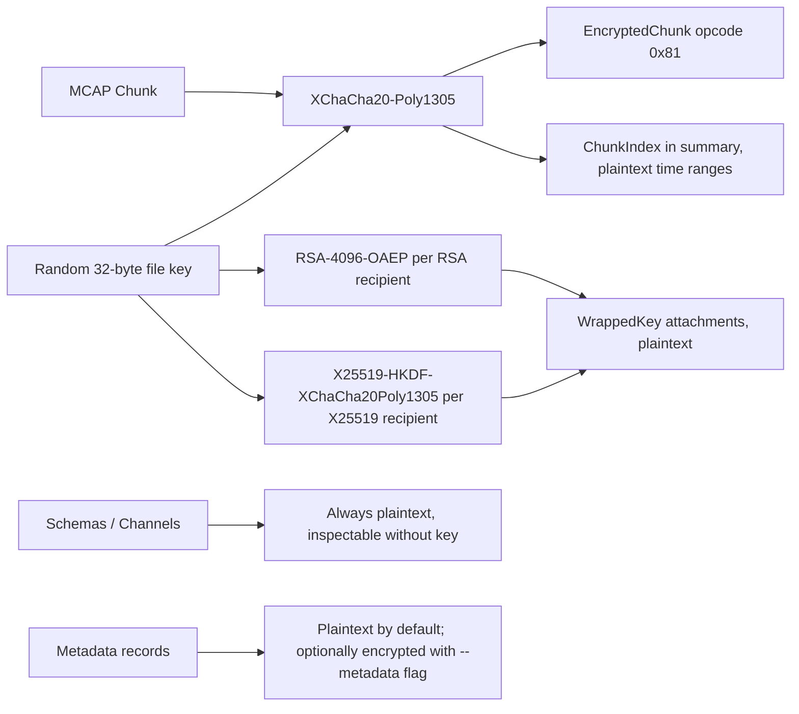

<h1>

mcap-encrypt
</h1>

**Public-key encryption for MCAP robotics logs, built for the [Foxglove](https://foxglove.dev) platform.**

**Build**  
[](https://github.com/remete618/mcap-encrypt/actions/workflows/ci.yml)
[](https://github.com/remete618/mcap-encrypt/releases/latest)
[](https://www.npmjs.com/package/mcap-encrypt)
[](https://pkg.go.dev/github.com/remete618/mcap-encrypt)
[](LICENSE)

**Security**  
[](https://scorecard.dev/viewer/?uri=github.com/remete618/mcap-encrypt)
[](https://app.fossa.com/projects/custom%2B62363%2Fgithub.com%2Fremete618%2Fmcap-encrypt?ref=badge_shield&issueType=license)
[](https://app.fossa.com/projects/custom%2B62363%2Fgithub.com%2Fremete618%2Fmcap-encrypt?ref=badge_shield&issueType=security)
[](https://renovatebot.com)

MCAP is the native data format for [Foxglove Studio](https://foxglove.dev/studio) and ROS 2. It has excellent tooling but no built-in encryption. `mcap-encrypt` protects chunk payloads with XChaCha20-Poly1305 while keeping schemas and channels readable for routing and inspection. No key is needed to read file structure.

Encrypting the whole file is easy. Keeping MCAP tooling useful after encryption is the harder part.

📌 *Status:* v0.x · experimental · not externally audited  
✅ *Best for:* MCAP logs at rest; full [Foxglove Studio](https://foxglove.dev/studio) visualization via bridge (same UX as a live robot); schemas + channels always readable  
🚫 *Not for:* hiding topic names, timestamps, or schema/channel definitions (those stay readable by design)

---

## Table of contents

**Core**
- [What it does](#what-it-does)
- [Quick start](#quick-start)
- [Security model](#security-model)
- [Performance](#performance)
- [Alternatives](#alternatives)

**Reference**
- [Install](#install)
- [CLI reference](#cli-reference)
- [Go library](#go-library)
- [TypeScript library](#typescript-library)
- [Python library](#python-library)
- [Cross-language compatibility](#cross-language-compatibility)

**Features**
- [Multi-recipient encryption](#multi-recipient-encryption)
- [Foxglove Studio integration](#foxglove-studio-integration)
- [Seekable encrypted files](#seekable-encrypted-files)

**Project**
- [Encrypted file format](#encrypted-file-format)
- [Known limitations](#known-limitations)
- [Contributing](#contributing)
- [License](#license)

---

## What it does

MCAP is the standard container format for robotics sensor data. Files can contain gigabytes of camera frames, lidar scans, and telemetry. `mcap-encrypt` adds at-rest encryption to those files without changing the outer structure.

<table>
<tr>
<td width="160" nowrap> <strong>1 · Encrypt</strong></td>
<td>Every chunk is encrypted with <strong>XChaCha20-Poly1305</strong>. A fresh random 32-byte key and 24-byte nonce are generated per file and per chunk. Nonce reuse is impossible.</td>
</tr>
<tr>
<td width="160" nowrap> <strong>2 · Wrap</strong></td>
<td>The symmetric key is wrapped separately for each recipient (<strong>RSA-4096</strong> or <strong>X25519</strong>) and stored as plaintext attachments before the first chunk. Any matching private key decrypts the whole file.</td>
</tr>
<tr>
<td width="160" nowrap> <strong>3 · Seek</strong></td>
<td>An unencrypted <strong>ChunkIndex</strong> in the summary section lets any MCAP reader navigate the file by time range without decrypting. Foxglove Studio can show the recording timeline without a key.</td>
</tr>
<tr>
<td width="160" nowrap> <strong>4 · Visualize</strong></td>
<td>The <strong>bridge</strong> command decrypts to a temporary file, loads all messages into memory, removes the temp file, then serves over the Foxglove WebSocket protocol. Connect Foxglove Studio exactly as you would to a live ROS 2 robot. No persistent decrypted file remains on disk.</td>
</tr>
</table>

### Encryption levels

Three levels of protection, each a superset of the previous:

| Level | CLI flag | What is encrypted | Readable without a key |
|---|---|---|---|
| **Data only** | *(default)* | Chunk payloads (sensor data, camera frames, lidar) | Schemas, channels, topic names, timestamps, Metadata records |
| **Data + metadata map** | `--metadata encrypt` | Chunk payloads + Metadata key-value pairs | Schemas, channels, topic names, timestamps, Metadata record names |
| **Data + full metadata** | `--metadata encrypt-all` | Chunk payloads + Metadata names + Metadata key-value pairs | Schemas, channels, topic names, timestamps only |

Schemas and channel names are always readable; that is intentional — they let MCAP tooling index and navigate the file without a key. If you need to hide topic names or schema definitions, `mcap-encrypt` is not the right tool.



---

## Quick start

```bash
# 1. Generate a key pair
mcap-encrypt keygen --out mykey
# Writes mykey.priv.pem (0600 permissions, keep secret) and mykey.pub.pem

# 2. Encrypt
mcap-encrypt encrypt --key mykey.pub.pem input.mcap encrypted.mcap

# 3. Decrypt to a standard MCAP file
mcap-encrypt decrypt --key mykey.priv.pem encrypted.mcap output.mcap

# 4. Visualize in Foxglove Studio without decrypting to disk
mcap-encrypt bridge --key mykey.priv.pem encrypted.mcap
# Connect Foxglove Studio to ws://localhost:8765
```

If the output file already exists, `encrypt` and `decrypt` fail with an error. Pass `--force` to overwrite.

---

## Security model

**Threat model:** `mcap-encrypt` assumes an adversary with full read access to encrypted files but without the recipient's private key. It does not protect against an adversary with access to process memory, the decryption machine, or the private key files.

`mcap-encrypt` encrypts MCAP chunk payloads, user attachment data, and optionally Metadata records. It does not encrypt the outer MCAP structure (schemas, channel names, timestamps).

| Layer | Algorithm | Purpose |
|---|---|---|
| Chunk encryption | XChaCha20-Poly1305 | Authenticated encryption for chunk record payloads |
| Key wrapping (RSA) | RSA-4096-OAEP-SHA-256 | Wraps the per-file symmetric key for RSA recipients |
| Key wrapping (X25519) | X25519-HKDF-SHA256-XChaCha20Poly1305 | Wraps the per-file symmetric key for X25519 recipients; HKDF salt: none; info: `"mcap-encrypt x25519 v1"` |
| Integrity binding | AEAD additional data (AAD) | Binds each encrypted chunk to its file, position, timing, compression, and size metadata |
| Truncation detection | HMAC-SHA-256 manifest | Detects tail truncation and strip attacks; required on all v3 files |

### What is protected

- Message payloads inside MCAP chunks.
- Attachment data (the raw bytes of every user attachment).
- Tampering with encrypted chunk ciphertext or the 16-byte Poly1305 authentication tag.
- Tampering with AAD-covered plaintext fields: `file_id`, `chunk_index`, `slot_id`, `compression`, `uncompressed_size`, `uncompressed_crc`, `message_start_time`, and `message_end_time`. Any modification fails authentication.
- Chunk swapping across files: `file_id` (a 16-byte random value, same for all recipients of a given file) is bound in the AAD.
- Chunk reordering within a file: `chunk_index` (zero-based position) is bound in the AAD.
- Tail truncation and manifest strip attacks: the HMAC-SHA-256 manifest attachment is required on all v3 files. Decrypting a v3 file with the manifest removed fails with an explicit error.

### What is not protected

The following remain in plaintext and are readable without a key:

| Data | Reason |
|---|---|
| Schema records | Preserved for MCAP tooling compatibility |
| Channel records, including topic names | Preserved for inspection and routing |
| Message start/end times per chunk | Preserved for timeline indexing |
| Compression algorithm and approximate chunk size | Stored as plaintext encrypted-chunk metadata |
| Ciphertext length | Chunks are not padded; approximate payload size is inferrable from ciphertext length |
| Attachment name and media type | Plaintext for enumeration without a key; data is encrypted |
| Metadata records | Plaintext by default; use `--metadata encrypt` or `--metadata encrypt-all` to protect them |
| Recipient key fingerprints | Stored in wrapped-key attachments |

If any of these fields are sensitive, strip or transform them before encryption, or use full-file encryption instead.

### Key handling

- Each encrypted file gets a fresh random 32-byte symmetric key generated by a CSPRNG.
- Each encrypted chunk gets a fresh random 24-byte XChaCha20-Poly1305 nonce. Nonce reuse is not possible.
- The symmetric key is wrapped once per recipient (RSA-OAEP-SHA-256 or X25519-HKDF-XChaCha20Poly1305) and stored as plaintext attachments before the first chunk.
- Encrypted MCAP files do not contain private keys.
- `mcap-encrypt keygen` writes `<basename>.priv.pem` to disk with `0600` permissions.

### Algorithm rationale

**XChaCha20-Poly1305 (not AES-GCM, not ChaCha20-Poly1305)**

The standard 12-byte nonce of AES-GCM and ChaCha20-Poly1305 creates a practical nonce-reuse risk when nonces are generated randomly at scale: with 2^32 chunks, collision probability exceeds 50%. A nonce reuse under AEAD is catastrophic, leaking the XOR of plaintexts and the authentication key. XChaCha20's 24-byte nonce raises that ceiling to 2^96, making random nonce generation safe for any realistic deployment. AES-GCM is faster on x86 with AES-NI hardware acceleration, but robotics compute (Jetson Orin, ARM Cortex-A series) often lacks AES-NI. XChaCha20-Poly1305 performs consistently across all architectures. It is also the cipher used by WireGuard and Signal and carries no patent encumbrances.

**RSA-4096 (not RSA-2048)**

RSA-2048 provides approximately 112 bits of security (NIST SP 800-57 estimate). NIST recommends RSA-2048 only through 2030 for new systems and recommends at least 3072 bits beyond that. Robotics log archives are long-lived: crash investigation records, regulatory data, and ML training datasets are routinely retained for 5-20 years. The key wrapping must remain secure for the lifetime of the data, not just the recording session. RSA-4096 provides approximately 140 bits of security and aligns with long-term NIST guidance. The performance penalty is negligible: key wrapping is a one-time operation per file, taking milliseconds regardless of file size.

**X25519 as an alternative to RSA**

X25519 elliptic-curve Diffie-Hellman offers 128-bit security with 32-byte keys, orders of magnitude faster key generation than RSA-4096, and a wrapped key output of only 104 bytes. For resource-constrained embedded hardware or high-throughput fleet deployments where key generation speed matters, X25519 is the right choice. Mixed-algorithm recipient lists are supported: the same file can be wrapped for both an RSA-4096 recipient and an X25519 recipient simultaneously. X25519 is used in TLS 1.3, the Signal Protocol, and WireGuard, and is standardized in RFC 7748.

### Test coverage

The library includes adversarial tests for ciphertext tampering, chunk swapping, chunk reordering, manifest strip attacks, and encrypted attachment tamper rejection. Four fuzz targets cover the parser surface: `FuzzDecodeEncryptedChunk`, `FuzzDecodeEncryptedAttachment`, `FuzzDecodeWrappedKeyData`, and `FuzzStreamDecrypt`. Cross-language compatibility is verified by 6 automated interop tests (RSA and X25519 in both directions, with and without attachments) run on every CI push. An HKDF test vector pins the X25519 key derivation to the Go reference implementation. Key rotation is covered by round-trip, multi-recipient, wrong-key rejection, and atomic-write tests in both Go and TypeScript. The warn callback is verified to fire on malformed key attachment slots and to stay silent on clean decrypts. Current count: **85+ Go unit tests**, **80 TypeScript unit tests**, **33 Python tests** (29 unit + 4 interop), 4 fuzz targets, **8 Go/TypeScript interop tests**.

### Audit status

This project has not been externally audited. Do not use it as the only protection layer for highly sensitive production data without independent review.

For the full threat model, resolved findings, and test coverage details, see [SECURITY.md](.github/SECURITY.md). To report a vulnerability, email radu@cioplea.com rather than opening a public issue.

---

## Performance

Benchmarks run on **Apple M3** (arm64), Go 1.24, zstd compression. Source data uses synthetic sequential-byte payloads (highly compressible); throughput on real robot sensor data with lower compression ratios will be closer to the Medium row.

| Scenario | Source file | Encrypt | Decrypt |
|---|---|---|---|
| Small — 100 msgs × 1 KB | ~105 KB | 5 MB/s | 0.4 MB/s |
| Medium — 1 000 msgs × 4 KB | ~4 MB | 16 MB/s | 1.4 MB/s |
| Large — 5 000 msgs × 64 KB | ~236 MB | 6.5 MB/s | 0.9 MB/s |

Reproduce:

```bash
go test ./pkg/mcapencrypt/ -run='^$' -bench='BenchmarkEncrypt|BenchmarkDecrypt' -benchtime=5s
```

**Encrypt** is dominated by zstd compression of each chunk plus XChaCha20-Poly1305. The RSA-OAEP key wrap happens once per file and is negligible. **Decrypt** does more work: it decrypts each chunk, decompresses, and rebuilds a fully-indexed MCAP from scratch (decompress + recompress + reindex), which is why it is roughly 10× slower than encrypt for the same file.

**TypeScript**: RSA wrapping uses the browser's native Web Crypto API. Bulk cipher work (`@noble/ciphers`) is pure JavaScript and is roughly 2–4× slower than Go for large files. For recordings over 500 MB, the Go CLI is recommended.

**Inspect** (`mcap-encrypt inspect`) requires no decryption and runs at disk read speed regardless of file size.

---

## Alternatives

| Approach | MCAP-inspectable after encrypt | Per-chunk stream | Multi-recipient public-key | MCAP-native | 🦊 Foxglove Studio ready |
|---|:---:|:---:|:---:|:---:|:---:|
| `gpg` / `age` (full-file) | ✗ | ✗ | ✅ *(age)* | ✗ | ✗ |
| Storage-layer *(dm-crypt, S3 SSE)* | ✅ *(mounted)* | ✗ | ✗ | ✗ | ✅ *(mounted)* |
| ROS 1 bag (AES-CBC / GPG) | ✗ | ✗ | ✗ | ✗ | ✗ |
| **mcap-encrypt** | **✅ partial** schemas + channels + timeline | **✅** | **✅** | **✅** | **✅** via bridge |

---

## Install

### Go CLI

```bash
go install github.com/remete618/mcap-encrypt/cmd/mcap-encrypt@latest
```

Or build from source:

```bash
git clone https://github.com/remete618/mcap-encrypt
cd mcap-encrypt
go build -o mcap-encrypt ./cmd/mcap-encrypt
```

### Homebrew (macOS / Linux)

```bash
brew install remete618/mcap-encrypt/mcap-encrypt
```

### Go library

```bash
go get github.com/remete618/mcap-encrypt/pkg/mcapencrypt
```

Requires Go 1.26+.

### TypeScript / Node.js

```bash
npm install mcap-encrypt
```

Requires Node.js 18+ (uses the built-in Web Crypto API). Works in modern browsers without polyfills.

### Python

```bash
pip install mcap-encrypt
```

Requires Python 3.10+. Installs `cryptography`, `pynacl`, `zstandard`, and `lz4` automatically.

---

## CLI reference

```
mcap-encrypt keygen   --out <basename>
mcap-encrypt encrypt  --key <pub.pem> [--key <pub2.pem>...] [--force] <input.mcap> <output.mcap>
mcap-encrypt decrypt  --key <priv.pem> [--force] <input.mcap> <output.mcap>
mcap-encrypt rotate   --old-key <priv.pem> --new-key <pub.pem> [--new-key <pub2.pem>...] [--force] <input.mcap> <output.mcap>
mcap-encrypt inspect  <input.mcap>
mcap-encrypt bridge   --key <priv.pem> [--addr <host:port>] <encrypted.mcap>
```

### keygen

Generates an RSA-4096 key pair.

| Flag | Description |
|---|---|
| `--out <basename>` | Output basename. Writes `<basename>.pub.pem` and `<basename>.priv.pem`. Default: `mcap-key`. |

For X25519 key pairs, use `GenerateX25519KeyPair` in the Go library directly.

### encrypt

Encrypts a standard MCAP file. Input must be a chunked MCAP (non-chunked files are rejected with a clear error). Validates magic bytes before starting. Single-pass, streaming. Writes an unencrypted ChunkIndex in the summary section so MCAP readers can navigate by time range without decrypting.

| Flag | Description |
|---|---|
| `--key <pub.pem>` | Path to RSA-4096 or X25519 public key. Repeatable for multiple recipients. Required. |
| `--metadata plaintext\|encrypt\|encrypt-all` | How to handle Metadata records (see table below). Default: `plaintext`. |
| `--force` | Overwrite output file if it exists. |

**Metadata encryption modes** (opcode `0x83`, format v6):

| Mode | What is visible without a key | What is encrypted |
|---|---|---|
| `plaintext` (default) | Name + all key-value pairs | Nothing — full passthrough |
| `encrypt` | Record name only | All key-value pairs |
| `encrypt-all` | Nothing | Name + all key-value pairs |

Foxglove Studio skips unknown opcode `0x83` records entirely, so `encrypt` and `encrypt-all` are both fully opaque to Studio without a key. The difference only matters for `mcap-encrypt inspect` and external tooling that reads encrypted files directly.

While running, the CLI shows a live progress bar:

```
  |  encrypting  [=========>        ]  45%  1.4 GB / 3.2 GB  45.3 MB/s  ETA 40s
```

Press **Ctrl-Z** to pause mid-operation (the partial output file is preserved safely). Run `fg` in the shell to resume exactly where it stopped.

To encrypt for multiple recipients, repeat `--key`:

```bash
mcap-encrypt encrypt --key alice.pub.pem --key bob.pub.pem input.mcap encrypted.mcap
# Either alice.priv.pem or bob.priv.pem can decrypt the result.
```

### decrypt

Decrypts an encrypted MCAP file. Produces a standard, fully-indexed MCAP readable by any MCAP-compatible tool including Foxglove Studio (open the output file directly).

While running, the CLI shows the same live progress bar as encrypt. Press **Ctrl-Z** to pause, `fg` to resume.

| Flag | Description |
|---|---|
| `--key <priv.pem>` | Path to RSA-4096 or X25519 private key. Required. |
| `--force` | Overwrite output file if it exists. |

### rotate

Changes the recipient keys of an encrypted MCAP without decrypting any chunk data. The symmetric key is unwrapped with the old private key and re-wrapped for each new public key. All `EncryptedChunk` and `EncryptedAttachment` records are copied verbatim. O(file size) I/O with zero message decryption. The data-encryption key (DEK) itself does not change; to replace the DEK, decrypt and re-encrypt with a new key (see Known limitations).

```bash
mcap-encrypt rotate --old-key old.priv.pem --new-key new.pub.pem encrypted.mcap rotated.mcap
# old.priv.pem can no longer decrypt rotated.mcap; new.pub.pem's private key can.

# Rotate to multiple new recipients at once:
mcap-encrypt rotate --old-key old.priv.pem --new-key alice.pub.pem --new-key bob.pub.pem enc.mcap rotated.mcap
```

| Flag | Description |
|---|---|
| `--old-key <priv.pem>` | Path to the current RSA-4096 or X25519 private key. Required. |
| `--new-key <pub.pem>` | Path to a new RSA-4096 or X25519 public key. Repeatable. Required. |
| `--force` | Overwrite output file if it exists. |

### inspect

Prints metadata from an encrypted (or plain) MCAP without decrypting. No private key required. Runs at disk read speed regardless of file size.

```bash
mcap-encrypt inspect recording.enc.mcap
# file:         recording.enc.mcap  (312 MB)
# encrypted:    yes  (format v3)
# file_id:      3f4a5b6c7d8e9f0a1b2c3d4e5f6a7b8c
# chunks:       1024  (zstd)
# attachments:  4 encrypted
#
# recipients (2):
#   [1]  rsa-oaep-sha256                           8e957de8...
#   [2]  x25519-hkdf-xchacha20poly1305             a1b2c3d4...
```

### bridge

Decrypts an encrypted MCAP file, loads all messages into memory, then serves them over the [Foxglove WebSocket protocol](https://github.com/foxglove/ws-protocol). Foxglove Studio connects to the bridge exactly as it connects to a live ROS 2 robot running `foxglove-bridge`: same protocol, same Studio UI, same workflow. A temporary file is written during loading and removed immediately; no persistent decrypted file remains on disk.

```bash
mcap-encrypt bridge --key analyst.priv.pem recording.mcap
# done  2.1s
# listening: ws://localhost:8765
# Open Foxglove Studio → Add connection → Foxglove WebSocket → ws://localhost:8765
# Press Ctrl-C to stop.
```

| Flag | Description |
|---|---|
| `--key <priv.pem>` | Path to RSA-4096 or X25519 private key. Required. |
| `--addr <host:port>` | WebSocket listen address. Default: `localhost:8765`. |

**How it works:** On startup, the bridge decrypts the entire file into memory and loads all schemas, channels, and messages. When Foxglove Studio connects and subscribes to topics, the bridge streams binary `MESSAGE_DATA` frames in log-time order over the WebSocket connection. Multiple Studio instances can connect simultaneously; each gets an independent stream. Press Ctrl-C to stop.

**Security:** The private key never leaves your machine. The decrypted content exists only in RAM and is served over localhost by default. If you change `--addr` to a non-localhost address, put a TLS-terminating reverse proxy (nginx, Caddy) in front of the bridge.

---

## Go library

```go
import "github.com/remete618/mcap-encrypt/pkg/mcapencrypt"

// Generate key pairs
if err := mcapencrypt.GenerateKeyPair("mykey"); err != nil { ... }              // RSA-4096
if err := mcapencrypt.GenerateX25519KeyPair("mykey-x25519"); err != nil { ... } // X25519

// Encrypt for a single recipient
if err := mcapencrypt.Encrypt("input.mcap", "encrypted.mcap", "mykey.pub.pem"); err != nil { ... }

// Encrypt for multiple recipients; any private key can decrypt
if err := mcapencrypt.EncryptMulti("input.mcap", "encrypted.mcap", []string{
    "alice.pub.pem",
    "bob.pub.pem",
    "foxglove.pub.pem", // Foxglove can decrypt server-side once integration is live
}); err != nil { ... }

// Decrypt: produces a standard indexed MCAP
if err := mcapencrypt.Decrypt("encrypted.mcap", "output.mcap", "mykey.priv.pem"); err != nil { ... }

// Decrypt with a warning callback for non-fatal parse issues
err := mcapencrypt.DecryptWithOptions(r, w, "mykey.priv.pem", mcapencrypt.DecryptOptions{
    WarnFunc: func(msg string) { log.Println("warn:", msg) },
})

// Rotate keys without re-encrypting chunk data
if err := mcapencrypt.RotateKeyFile("encrypted.mcap", "rotated.mcap", "old.priv.pem", []string{"new.pub.pem"}); err != nil { ... }

// Encrypt from any io.Reader, write to any io.Writer (PEM strings, no key files needed)
err := mcapencrypt.EncryptStream(r, w, []string{pubKeyPem})
err  = mcapencrypt.EncryptStream(r, w, []string{alicePem, bobPem}) // multi-recipient

// Encrypt with options (metadata mode, progress callback)
err = mcapencrypt.EncryptWithOptions("input.mcap", "enc.mcap", []string{"mykey.pub.pem"}, mcapencrypt.EncryptOptions{
    MetadataMode: mcapencrypt.MetadataEncrypt,     // or MetadataEncryptAll / MetadataPlaintext
    Progress:     func(n int64) { fmt.Printf("%d bytes written\n", n) },
})

// Parse a public key from a PEM string (no file I/O)
pub, err := mcapencrypt.ParsePublicKeyPEM(pubKeyPem) // *rsa.PublicKey or *ecdh.PublicKey

// Inspect metadata without a private key
res, err := mcapencrypt.InspectFile("encrypted.mcap")
// res.IsEncrypted, res.FileID, res.ChunkCount, res.Compression, res.Recipients

// Bridge: load state once, serve many connections
state, err := mcapencrypt.LoadBridgeState("encrypted.mcap", "mykey.priv.pem")
if err != nil { ... }
ctx, cancel := context.WithCancel(context.Background())
defer cancel()
if err := mcapencrypt.ServeBridge(ctx, state, "localhost:8765"); err != nil { ... }
```

**Notes:**

- `Encrypt` is a convenience wrapper for `EncryptMulti` with a single key.
- `EncryptMulti` wraps the same symmetric key for each public key in the list. The file can be decrypted with any of the corresponding private keys. RSA and X25519 recipients can be mixed.
- `Decrypt` takes an encrypted MCAP and writes a standard indexed MCAP with zstd-compressed chunks. It tries all wrapped-key attachments and succeeds when one matches the provided private key.
- `DecryptWithOptions` accepts a `DecryptOptions{WarnFunc: func(string)}` that is called for non-fatal issues (e.g. a malformed wrapped-key attachment slot). Silent by default; fully backward compatible with `Decrypt`.
- `RotateKeys`/`RotateKeyFile` change recipients without touching chunk ciphertext. The original `file_id` is preserved so all existing AEAD authenticators remain valid.
- `LoadBridgeState` decrypts the file into memory. `ServeBridge` starts the WebSocket server. Separating the two lets you show progress during the load phase before the server is announced.
- If `Encrypt`, `EncryptMulti`, `Decrypt`, or `RotateKeyFile` fails partway, the output file is automatically removed.

---

## TypeScript library

```typescript
import { generateKeyPair, generateX25519KeyPair, encryptMcap, decryptMcap, iterateMessages } from "mcap-encrypt";
import { readFileSync, writeFileSync } from "node:fs";

// Generate a key pair — RSA-4096 or X25519
const { publicKeyPem, privateKeyPem } = await generateKeyPair();        // RSA-4096
const { publicKeyPem: x25519Pub, privateKeyPem: x25519Priv } = await generateX25519KeyPair(); // X25519

// Encrypt for a single recipient
const plain = new Uint8Array(readFileSync("input.mcap"));
const encrypted = await encryptMcap(plain, publicKeyPem);
writeFileSync("encrypted.mcap", encrypted);

// Encrypt for multiple recipients; any private key can decrypt
const encrypted2 = await encryptMcap(plain, [alicePubPem, bobPubPem]);

// Decrypt to a fully-indexed MCAP buffer (with ChunkIndex and summary section)
const enc = new Uint8Array(readFileSync("encrypted.mcap"));
const decrypted = await decryptMcap(enc, privateKeyPem);
writeFileSync("output.mcap", decrypted);

// Stream messages directly, no intermediate file
for await (const { schema, channel, message } of iterateMessages(enc, privateKeyPem)) {
  console.log(channel.topic, message.logTime, message.data);
}
```

**API surface:**

| Export | Signature | Description |
|---|---|---|
| `generateKeyPair` | `() => Promise<KeyPair>` | Generates RSA-4096 key pair, returns PEM strings. |
| `generateX25519KeyPair` | `() => Promise<X25519KeyPair>` | Generates X25519 key pair, returns PEM strings. |
| `encryptMcap` | `(input: Uint8Array, pubKeyPem: string \| string[], options?: EncryptMcapOptions) => Promise<Uint8Array>` | Encrypts a chunked MCAP in memory. Accepts RSA and X25519 public keys; mixed arrays are supported. `options.metadataMode` controls Metadata record handling (`"plaintext"` default, `"encrypt"`, `"encrypt-all"`). |
| `decryptMcap` | `(input: Uint8Array, privKeyPem: string, onWarn?: (msg: string) => void) => Promise<Uint8Array>` | Decrypts to a fully-indexed MCAP buffer. Optional `onWarn` called for non-fatal parse issues. |
| `rotateMcapKeys` | `(input: Uint8Array, oldPrivKeyPem: string, newPubKeyPems: string \| string[]) => Promise<Uint8Array>` | Re-wraps the symmetric key for new recipients without decrypting chunk data. |
| `inspectMcap` | `(input: Uint8Array) => InspectResult` | Returns metadata (file_id, chunk count, compression, recipients) without decrypting. No private key required. |
| `iterateMessages` | `(input: Uint8Array, privKeyPem: string) => AsyncGenerator<{schema, channel, message}>` | Streams decrypted messages without materializing output. |

**Browser compatibility:** Uses the Web Crypto API and `fzstd` (pure-TypeScript zstd). No WASM, no Node-specific APIs. Works in Chromium 89+, Firefox 90+, Safari 15+.

---

## Python library

```python
from mcap_encrypt import (
    encrypt_mcap, decrypt_mcap, iterate_messages,
    inspect_mcap, rotate_mcap_keys,
    generate_key_pair, generate_x25519_key_pair,
)

# Generate a key pair — RSA-4096 or X25519
pub_pem, priv_pem = generate_key_pair()              # RSA-4096
x25519_pub, x25519_priv = generate_x25519_key_pair() # X25519

# Encrypt for a single recipient
with open("input.mcap", "rb") as f:
    plain = f.read()
encrypted = encrypt_mcap(plain, pub_pem)
with open("encrypted.mcap", "wb") as f:
    f.write(encrypted)

# Encrypt for multiple recipients; any private key can decrypt
encrypted2 = encrypt_mcap(plain, [alice_pub_pem, bob_pub_pem])

# Decrypt to a fully-indexed MCAP buffer
with open("encrypted.mcap", "rb") as f:
    enc = f.read()
decrypted = decrypt_mcap(enc, priv_pem)
with open("output.mcap", "wb") as f:
    f.write(decrypted)

# Stream messages directly, no intermediate file
for schema, channel, message in iterate_messages(enc, priv_pem):
    print(channel.topic, message.log_time)

# Inspect metadata without a private key
result = inspect_mcap(enc)
# result.is_encrypted, result.file_id, result.chunk_count, result.compression, result.recipients

# Rotate keys without re-encrypting chunk data
rotated = rotate_mcap_keys(enc, old_priv_pem, [new_pub_pem])
```

**Install:**

```bash
pip install mcap-encrypt
```

Requires Python 3.10+. XChaCha20-Poly1305 is provided by `pynacl` (libsodium), which is compatible with `cryptography>=42`.

**API surface:**

| Export | Signature | Description |
|---|---|---|
| `generate_key_pair` | `() -> tuple[str, str]` | Generates RSA-4096 key pair, returns `(pub_pem, priv_pem)`. |
| `generate_x25519_key_pair` | `() -> tuple[str, str]` | Generates X25519 key pair, returns `(pub_pem, priv_pem)`. |
| `encrypt_mcap` | `(data: bytes, pub_key_pem: str \| list[str], *, metadata: str = "plaintext") -> bytes` | Encrypts a chunked MCAP in memory. Accepts RSA and X25519 public keys; mixed lists are supported. `metadata` controls Metadata record handling: `"plaintext"` (default), `"encrypt"` (map only), `"encrypt-all"` (name + map). |
| `decrypt_mcap` | `(data: bytes, priv_key_pem: str) -> bytes` | Decrypts to a fully-indexed MCAP buffer. |
| `rotate_mcap_keys` | `(data: bytes, old_priv_pem: str, new_pub_pems: list[str]) -> bytes` | Re-wraps the symmetric key for new recipients without decrypting chunk data. |
| `inspect_mcap` | `(data: bytes) -> InspectResult` | Returns metadata (file_id, chunk count, compression, recipients) without decrypting. No private key required. |
| `iterate_messages` | `(data: bytes, priv_key_pem: str) -> Iterator[tuple[Schema, Channel, Message]]` | Streams decrypted messages without materializing a full output buffer. |

**Dependencies:** `cryptography>=41`, `pynacl>=1.5` (XChaCha20-Poly1305 via libsodium), `zstandard>=0.19`, `lz4>=4.0`.

**Runtime note:** Server-side only. Requires libsodium (installed automatically via `pynacl`). Does not run in WASM or browser environments.

---

## Cross-language compatibility

Keys and encrypted files produced by any implementation are fully compatible with all others (Go, TypeScript, Python):

```bash
# Go encrypts, TypeScript or Python decrypts
mcap-encrypt encrypt --key mykey.pub.pem input.mcap enc.mcap
# TypeScript: decryptMcap(readFileSync("enc.mcap"), privKeyPem)
# Python:     decrypt_mcap(open("enc.mcap","rb").read(), priv_pem)

# TypeScript encrypts, Go decrypts
# encryptMcap(data, pubKeyPem) → write to ts-enc.mcap
mcap-encrypt decrypt --key mykey.priv.pem ts-enc.mcap output.mcap

# Python encrypts, Go decrypts
# encrypt_mcap(plain, pub_pem) → write to py-enc.mcap
mcap-encrypt decrypt --key mykey.priv.pem py-enc.mcap output.mcap
```

All three implementations agree on:
- XChaCha20-Poly1305 nonce size (24 bytes), key size (32 bytes)
- AEAD AAD encoding: `file_id` (16 bytes) + `chunk_index` (uint64 LE) + `slot_id` + `compression` + `uncompressed_size` (uint64 LE) + `uncompressed_crc` (uint32 LE) + `message_start_time` (uint64 LE) + `message_end_time` (uint64 LE)
- RSA-4096-OAEP-SHA-256 key wrapping (RSA recipients)
- X25519-HKDF-SHA256-XChaCha20Poly1305 key wrapping (X25519 recipients): HKDF salt `nil` (RFC 5869 default = 32 zero bytes), info string `"mcap-encrypt x25519 v1"`, wire format `ephem_pub(32) || nonce(24) || ciphertext(48)`
- `EncryptedChunk` wire format (opcode `0x81`)
- `EncryptedAttachment` wire format (opcode `0x82`)
- `EncryptedMetadata` wire format (opcode `0x83`)
- Wrapped key attachment format (version `0x03`, 16-byte `file_id`, length-prefixed fields; `0x02` is accepted for legacy read-back)
- PKCS#8 private key format (PEM label `PRIVATE KEY`) and SPKI public key format (PEM label `PUBLIC KEY`) for both RSA and X25519 keys

All three implementations support **RSA-4096 and X25519 recipients**. Files encrypted with either key type can be encrypted and decrypted by the Go library, the TypeScript library, and the Python library. Mixed-algorithm recipient lists (RSA + X25519 in the same file) are supported by all three.

Cross-language compatibility is verified by automated interop tests run on every CI push.

**Compression note:** The Go library automatically re-compresses LZ4 chunks to zstd during encryption, so any source MCAP is safe to pass to `mcap-encrypt encrypt`. The TypeScript library does **not** support LZ4 input; `encryptMcap()` throws a clear error if the source contains LZ4 chunks. Use the Go CLI to normalize those files first.

---

## Multi-recipient encryption

A single encrypted MCAP file can be wrapped for multiple recipients. Each recipient holds only their own private key. The chunk ciphertext is written once and is identical for all recipients; only the key wrapping differs. This is the same model used by PGP multi-recipient encryption and S/MIME.

### Any two analysts, one file

```bash
mcap-encrypt encrypt \
  --key alice.pub.pem \
  --key bob.pub.pem \
  recording.mcap encrypted.mcap
# Either alice.priv.pem or bob.priv.pem can decrypt.
```

### You + Foxglove

This use case is designed into the format and the library supports it today. What it requires from Foxglove is a one-time integration: publish an RSA-4096 public key at a stable URL, and wire up a short ingest path using `iterateMessages()` from the npm package. No protocol changes, no special upload flow, no plaintext file ever uploaded.

Once that integration is live, adding Foxglove as a recipient is a single extra `--key` flag at encrypt time:

```bash
mcap-encrypt encrypt \
  --key your.pub.pem \
  --key foxglove.pub.pem \
  recording.mcap encrypted.mcap
# You decrypt with your.priv.pem.
# Foxglove decrypts on ingest with its own key.
# The ciphertext is identical for both recipients.
```

What each party can do:

| | Your private key | Foxglove private key |
|---|---|---|
| Decrypt locally | ✅ | ✅ |
| Visualize via bridge | ✅ | ✅ (server-side) |
| Read plaintext MCAP | Never stored | Never stored |
| See each other's key | ✗ | ✗ |

The file is fully encrypted in transit and at rest. No party shares keys. The ciphertext is the same blob regardless of how many recipients were added.

---

## Foxglove Studio integration

`mcap-encrypt` works with [Foxglove Studio](https://foxglove.dev/studio) in the same way that `foxglove-bridge` connects a live ROS 2 robot. The `bridge` command decrypts your encrypted MCAP file, loads it into memory, then serves it over the [Foxglove WebSocket protocol](https://github.com/foxglove/ws-protocol). This makes encrypted MCAP files a first-class data source in Foxglove Studio, indistinguishable from a live robot connection. Your private key never leaves your machine. No persistent decrypted file remains on disk.

### How to connect

**Step 1: start the bridge**

```bash
mcap-encrypt bridge --key analyst.priv.pem recording.mcap
```

Output:
```
loading: recording.mcap
  /  decrypting  2.1s
done  2.1s
listening: ws://localhost:8765
Open Foxglove Studio → Add connection → Foxglove WebSocket → ws://localhost:8765
Press Ctrl-C to stop.
```

**Step 2: open Foxglove Studio**

1. Open [Foxglove Studio](https://foxglove.dev/studio) (desktop app or web at `studio.foxglove.dev`).
2. Click **Open data source**.
3. Select **Foxglove WebSocket**.
4. Enter `ws://localhost:8765`.
5. Click **Open**.

All topics, schemas, and messages from the encrypted file appear immediately. Camera feeds, lidar point clouds, plots, and diagnostics render exactly as they do with a live ROS 2 source. You can scrub the timeline, jump to specific timestamps, and use all Foxglove panels.

### Comparison with foxglove-bridge

| | `foxglove-bridge` (ROS 2 live) | `mcap-encrypt bridge` (encrypted file) |
|---|---|---|
| **Data source** | Live ROS 2 node graph | Encrypted MCAP file |
| **Protocol** | Foxglove WebSocket v1 | Foxglove WebSocket v1 |
| **Connect in Studio** | `ws://localhost:8765` | `ws://localhost:8765` |
| **Key required** | No | Yes (your private key) |
| **Decrypted file on disk** | n/a | Never |
| **Multiple clients** | Yes | Yes (each gets own stream) |

The commands are identical from Foxglove Studio's perspective. Switch between a live robot and an encrypted log by changing the WebSocket URL.

### Custom address

```bash
# Listen on a specific port
mcap-encrypt bridge --key analyst.priv.pem --addr localhost:9090 recording.mcap

# Listen on all interfaces (use with a TLS reverse proxy in production)
mcap-encrypt bridge --key analyst.priv.pem --addr 0.0.0.0:8765 recording.mcap
```

> **Security note:** By default the bridge listens only on `localhost`. The decrypted stream is unencrypted over the WebSocket connection. If you expose the bridge on a non-localhost address, put a TLS-terminating reverse proxy (nginx, Caddy) in front.

### Bridge in a Go application

```go
import (
    "context"
    "github.com/remete618/mcap-encrypt/pkg/mcapencrypt"
)

// Load once, serve many connections.
state, err := mcapencrypt.LoadBridgeState("recording.mcap", "analyst.priv.pem")
if err != nil { log.Fatal(err) }

ctx, cancel := context.WithCancel(context.Background())
defer cancel()

// Blocks until ctx is cancelled or the server fails.
if err := mcapencrypt.ServeBridge(ctx, state, "localhost:8765"); err != nil {
    log.Fatal(err)
}
```

---

## Seekable encrypted files

Encrypted files produced by `mcap-encrypt` include a full **summary section** after the data end record:

- **Schema records:** topic message types, readable without a key
- **Channel records:** topic names and encodings, readable without a key
- **Statistics record:** chunk count, schema count, channel count, time range
- **ChunkIndex records:** one per encrypted chunk, with the chunk's time range and exact file offset
- **SummaryOffset records:** index into the summary itself

This means Foxglove Studio can open an encrypted file, show the recording timeline, and list all topics without a key. The file is opaque (no messages) until decrypted, but the outer structure is fully navigable.

After running `mcap-encrypt decrypt`, the output is a standard fully-indexed MCAP that any MCAP-compatible tool can seek and open directly.

See [FORMAT.md](FORMAT.md) for the complete binary specification.

---

## Encrypted file format

The outer file is a valid MCAP. Standard MCAP readers can open it and inspect schemas, channels, and the timeline. They will not find any messages because the `EncryptedChunk` opcode (`0x81`) is not a standard MCAP record type. The ChunkIndex records in the summary section point at these encrypted chunks, enabling time-range inspection without decryption.

```
[magic] [Header] [Schema]* [Channel]* [WrappedKeyAttachment]+
[EncryptedChunk]* [EncryptedAttachment]* [EncryptedMetadata]* [ManifestAttachment] [DataEnd]
[Schema]* [Channel]* [Statistics] [ChunkIndex]* [SummaryOffset]* [Footer]
[magic]
```

There is one `WrappedKeyAttachment` per recipient. All wrapped copies encode the same symmetric key, wrapped separately for each public key. `EncryptedChunk` and `EncryptedAttachment` records are interleaved in source order. The `ManifestAttachment` stores the chunk count and an HMAC-SHA-256 bound to the symmetric key and file identity, enabling truncation detection on decrypt. The summary section allows inspection of the recording timeline and topics without a key.

### WrappedKeyAttachment

A standard MCAP Attachment record (opcode `0x09`) with:

| Field | Value |
|---|---|
| `name` | `mcap_encryption_key` |
| `media_type` | `application/x-mcap-wrapped-key` |
| `data` | Binary payload described below |

The `data` payload (all strings and byte fields use 4-byte LE length prefixes):

| Field | Description |
|---|---|
| version | `0x03` (uint8); `0x02` is accepted by decoders for legacy files. Version 3 requires a manifest attachment; decrypting without one fails. |
| file_id | 16 random bytes; same across all recipients of the same file |
| key_id | Hex-encoded SHA-256 of the recipient's SPKI public key DER encoding |
| algorithm | `xchacha20poly1305` |
| kek_algorithm | `rsa-oaep-sha256` or `x25519-hkdf-xchacha20poly1305` |
| wrapped_key | Wrapped symmetric key; 512 bytes for RSA-4096, 104 bytes for X25519 |

### EncryptedChunk (opcode `0x81`)

| Field | Type | Description |
|---|---|---|
| `message_start_time` | `uint64 LE` | Plaintext; earliest log time in this chunk |
| `message_end_time` | `uint64 LE` | Plaintext; latest log time in this chunk |
| `uncompressed_size` | `uint64 LE` | Byte length of the records after decompression |
| `uncompressed_crc` | `uint32 LE` | CRC32-IEEE of the decompressed records (0 = not checked) |
| `compression` | `string` | Compression applied before encryption: `"zstd"` or `""` |
| `slot_id` | `string` | Content-key slot identifier included in AAD. Currently always `"key-1"`. |
| `nonce` | `bytes` | 24-byte XChaCha20 nonce (4-byte LE length prefix + 24 bytes) |
| `encrypted_data` | `bytes` | Ciphertext including the 16-byte Poly1305 tag (4-byte LE length prefix + N bytes) |

### EncryptedAttachment (opcode `0x82`)

| Field | Type | Description |
|---|---|---|
| `name` | `string` | Attachment name (plaintext) |
| `media_type` | `string` | Media type (plaintext) |
| `log_time` | `uint64 LE` | Log timestamp, nanoseconds (plaintext) |
| `create_time` | `uint64 LE` | Creation timestamp, nanoseconds (plaintext) |
| `nonce` | `bytes` | 24-byte XChaCha20 nonce (4-byte LE length prefix + 24 bytes) |
| `encrypted_data` | `bytes` | Ciphertext of the attachment data including the 16-byte Poly1305 tag |

AAD binds `file_id`, `name`, `media_type`, `log_time`, and `create_time`. Altering any plaintext field or the ciphertext causes authentication to fail.

### EncryptedMetadata (opcode `0x83`)

Only present when `--metadata encrypt` or `--metadata encrypt-all` is passed. In the default `plaintext` mode, standard `Metadata` records pass through unchanged and no `0x83` records are written.

| Field | Type | Description |
|---|---|---|
| `flags` | `uint8` | `0x00` = encrypt map only (name stored plaintext); `0x01` = encrypt everything (name + map) |
| `name` | `string` | Record name (plaintext when `flags=0x00`; empty string when `flags=0x01`) |
| `nonce` | `bytes` | 24-byte XChaCha20 nonce (4-byte LE length prefix + 24 bytes) |
| `encrypted_data` | `bytes` | Ciphertext including the 16-byte Poly1305 tag (4-byte LE length prefix + N bytes) |

AAD for `flags=0x00` binds `file_id + name`. AAD for `flags=0x01` binds `file_id` only (the name is inside the ciphertext). Standard MCAP readers that do not know opcode `0x83` skip these records gracefully.

All `WrappedKeyAttachment` records appear before the first `EncryptedChunk`. Decoders can begin streaming decryption in a single pass without buffering chunks.

See [FORMAT.md](FORMAT.md) for the complete binary specification including AAD serialization and version history.

---

## Known limitations

The following are current constraints, not bugs. The cryptographic core uses standard AEAD primitives (XChaCha20-Poly1305) and is covered by adversarial and fuzz tests. It has not been externally audited.

### Functional limitations

| Limitation | Impact | Workaround |
|---|---|---|
| **No DEK rotation** | `rotate` changes which recipients can decrypt (re-wraps the same symmetric key) but does not generate a new data-encryption key. To replace the DEK itself, decrypt and re-encrypt with a new key. | `mcap-encrypt decrypt --key old.priv.pem enc.mcap plain.mcap && mcap-encrypt encrypt --key new.pub.pem plain.mcap enc2.mcap` |
| **Attachment metadata is plaintext** | Attachment name, media type, and timestamps are readable without a key. Data is encrypted. | If attachment names are sensitive, use opaque names before writing the MCAP. |
| **Metadata records are plaintext by default** | Arbitrary key-value metadata passes through in plaintext unless `--metadata encrypt` or `--metadata encrypt-all` is used. | Use `--metadata encrypt` to encrypt the map while keeping the name readable, or `--metadata encrypt-all` to encrypt both name and map (Go, TypeScript, Python). |
| **Chunks are not padded** | Ciphertext length reveals approximate plaintext payload size. | Strip or normalize chunk sizes before encrypting if payload size is sensitive. |
| **Input must be chunked** | Non-chunked MCAP files are rejected. | Re-encode with chunking enabled (the Foxglove CLI and most MCAP writers produce chunked output by default). |
| **Bridge loads everything into memory** | Large files require sufficient RAM. | Use `decrypt` to produce a standard file, then open it in Foxglove Studio directly. |

### TypeScript-specific limitations

| Limitation | Impact | Notes |
|---|---|---|
| **In-memory only** | The TypeScript API holds the entire file in a `Uint8Array`. | Use the Go CLI for files larger than available RAM. |
| **No LZ4 support** | `encryptMcap()` throws if any source chunk uses LZ4 compression. | Use the Go CLI to encrypt LZ4 source files; it normalizes to zstd automatically. |

### Roadmap

- External security audit (gate for v1.0).

---

## Contributing

Issues and PRs welcome at [github.com/remete618/mcap-encrypt](https://github.com/remete618/mcap-encrypt). Please read [CONTRIBUTING.md](CONTRIBUTING.md) first.

**Open tasks:**

| # | Task | Difficulty | Issue |
|---|---|---|---|
| 1 | Browser smoke test (Vitest browser mode) | medium | [#17](https://github.com/remete618/mcap-encrypt/issues/17) |

Run tests locally before opening a PR:

```bash
# Go
go test ./...

# TypeScript
cd ts && npm test

# Python
cd py && pip install -e ".[dev]" && pytest

# Cross-language interop (requires Go installed)
cd ts && npm run test:interop
```

---

## License

[MIT](LICENSE). Use it freely: fork, embed, ship, and redistribute with attribution.
Contributions are welcome; see [CONTRIBUTING.md](CONTRIBUTING.md) for guidelines.

Radu Cioplea · [Foxglove](https://foxglove.dev) · [radu@cioplea.com](mailto:radu@cioplea.com) · [eyepaq.com](https://www.eyepaq.com) · [github.com/remete618](https://github.com/remete618)
