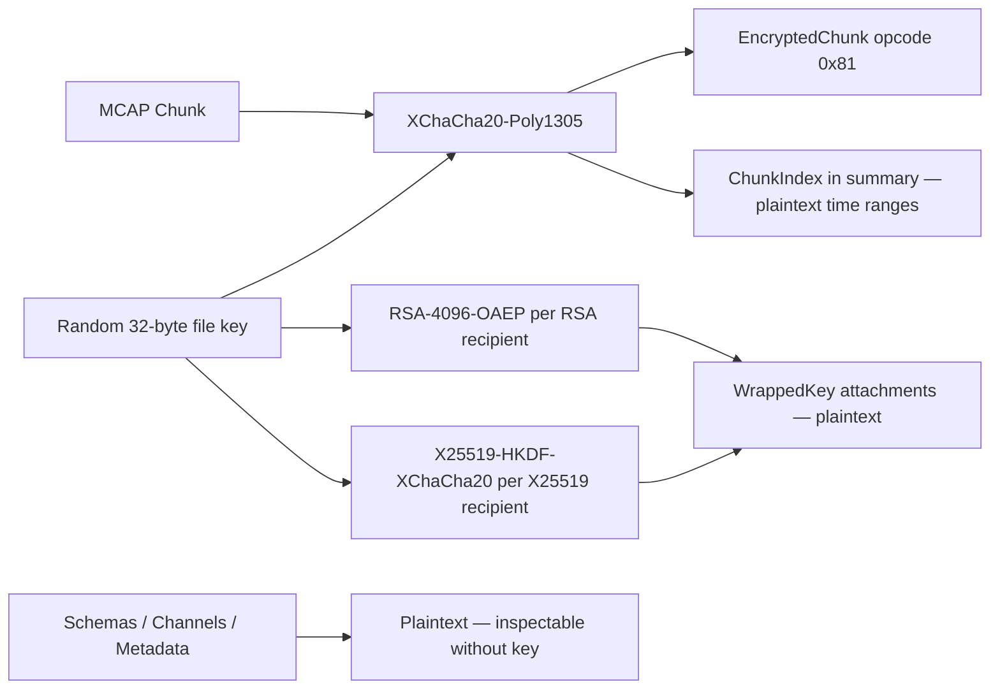

<h1>

mcap-encrypt
</h1>

**Public-key encryption for MCAP robotics logs.**

**Build**  
[](https://github.com/remete618/mcap-encrypt/actions/workflows/ci.yml)
[](https://github.com/remete618/mcap-encrypt/releases/latest)
[](https://www.npmjs.com/package/mcap-encrypt)
[](https://pkg.go.dev/github.com/remete618/mcap-encrypt)
[](LICENSE)

**Security**  
[](https://scorecard.dev/viewer/?uri=github.com/remete618/mcap-encrypt)
[](https://app.fossa.com/projects/custom%2B62363%2Fgithub.com%2Fremete618%2Fmcap-encrypt?ref=badge_shield&issueType=license)
[](https://app.fossa.com/projects/custom%2B62363%2Fgithub.com%2Fremete618%2Fmcap-encrypt?ref=badge_shield&issueType=security)
[](https://renovatebot.com)

Robotics logs contain camera frames, lidar scans, telemetry, and customer-site data. MCAP has great tooling but no native encryption. `mcap-encrypt` protects chunk payloads with XChaCha20-Poly1305 while keeping schemas and channels readable for routing and inspection. No key is needed to read file structure.

Encrypting the whole file is easy. Keeping MCAP tooling useful after encryption is the harder part.

📌 *Status:* v0.x · experimental · not externally audited  
✅ *Best for:* MCAP logs at rest, schemas + channels stay readable, Foxglove Studio compatible via bridge  
🚫 *Not for:* hiding topic names, timestamps, or attachments

---

## Table of contents

- [What it does](#what-it-does)
- [Foxglove Studio integration](#foxglove-studio-integration)
- [Multi-recipient encryption](#multi-recipient-encryption)
- [Seekable encrypted files](#seekable-encrypted-files)
- [Alternatives](#alternatives)
- [Security model](#security-model)
- [Quick start](#quick-start)
- [Install](#install)
- [CLI reference](#cli-reference)
- [Go library](#go-library)
- [TypeScript library](#typescript-library)
- [Cross-language compatibility](#cross-language-compatibility)
- [Encrypted file format](#encrypted-file-format)
- [Known limitations](#known-limitations)
- [Contributing](#contributing)
- [License](#license)

---

## What it does

MCAP is the standard container format for robotics sensor data (ROS 2, Foxglove, etc.). Files can contain gigabytes of camera frames, lidar scans, and telemetry. `mcap-encrypt` adds at-rest encryption to those files without changing the outer structure.

<table>
<tr>
<td width="160" nowrap> <strong>1 · Encrypt</strong></td>
<td>Every chunk is encrypted with <strong>XChaCha20-Poly1305</strong>. A fresh random 32-byte key and 24-byte nonce are generated per file and per chunk. Nonce reuse is impossible.</td>
</tr>
<tr>
<td width="160" nowrap> <strong>2 · Wrap</strong></td>
<td>The symmetric key is wrapped separately for each recipient (<strong>RSA-4096</strong> or <strong>X25519</strong>) and stored as plaintext attachments before the first chunk. Any matching private key decrypts the whole file.</td>
</tr>
<tr>
<td width="160" nowrap> <strong>3 · Seek</strong></td>
<td>An unencrypted <strong>ChunkIndex</strong> in the summary section lets any MCAP reader navigate the file by time range without decrypting. Foxglove Studio can show the recording timeline without a key.</td>
</tr>
<tr>
<td width="160" nowrap> <strong>4 · Visualize</strong></td>
<td>The <strong>bridge</strong> command decrypts to a temporary file, loads all messages into memory, removes the temp file, then serves over the Foxglove WebSocket protocol. Connect Foxglove Studio exactly as you would to a live ROS 2 robot — no persistent decrypted file remains on disk.</td>
</tr>
</table>



---

## Foxglove Studio integration

`mcap-encrypt` works with Foxglove Studio in the same way that `foxglove-bridge` connects a live ROS 2 robot. The `bridge` command decrypts your encrypted MCAP file, loads it into memory, then serves it over the [Foxglove WebSocket protocol](https://github.com/foxglove/ws-protocol). Your private key never leaves your machine. A temporary file is written during loading and removed immediately; no persistent decrypted file remains on disk.

### How to connect

**Step 1 — start the bridge:**

```bash
mcap-encrypt bridge --key analyst.priv.pem recording.mcap
```

Output:
```
loading: recording.mcap
  /  decrypting  2.1s
done  2.1s
listening: ws://localhost:8765
Open Foxglove Studio → Add connection → Foxglove WebSocket → ws://localhost:8765
Press Ctrl-C to stop.
```

**Step 2 — open Foxglove Studio:**

1. Open [Foxglove Studio](https://foxglove.dev/studio) (desktop app or web at `studio.foxglove.dev`).
2. Click **Open data source**.
3. Select **Foxglove WebSocket**.
4. Enter `ws://localhost:8765`.
5. Click **Open**.

All topics, schemas, and messages from the encrypted file appear immediately. Camera feeds, lidar point clouds, plots, and diagnostics render exactly as they do with a live ROS 2 source. You can scrub the timeline, jump to specific timestamps, and use all Foxglove panels.

### Comparison with foxglove-bridge

| | `foxglove-bridge` (ROS 2 live) | `mcap-encrypt bridge` (encrypted file) |
|---|---|---|
| **Data source** | Live ROS 2 node graph | Encrypted MCAP file |
| **Protocol** | Foxglove WebSocket v1 | Foxglove WebSocket v1 |
| **Connect in Studio** | `ws://localhost:8765` | `ws://localhost:8765` |
| **Key required** | No | Yes (your private key) |
| **Decrypted file on disk** | n/a | Never |
| **Multiple clients** | Yes | Yes (each gets own stream) |

The commands are identical from Foxglove Studio's perspective. Switch between a live robot and an encrypted log by changing the WebSocket URL.

### Custom address

```bash
# Listen on a specific port
mcap-encrypt bridge --key analyst.priv.pem --addr localhost:9090 recording.mcap

# Listen on all interfaces (use with a TLS reverse proxy in production)
mcap-encrypt bridge --key analyst.priv.pem --addr 0.0.0.0:8765 recording.mcap
```

> **Security note:** By default the bridge listens only on `localhost`. The decrypted stream is unencrypted over the WebSocket connection. If you expose the bridge on a non-localhost address, put a TLS-terminating reverse proxy (nginx, Caddy) in front.

### Bridge in a Go application

```go
import (
    "context"
    "github.com/remete618/mcap-encrypt/pkg/mcapencrypt"
)

// Load once, serve many connections.
state, err := mcapencrypt.LoadBridgeState("recording.mcap", "analyst.priv.pem")
if err != nil { log.Fatal(err) }

ctx, cancel := context.WithCancel(context.Background())
defer cancel()

// Blocks until ctx is cancelled or the server fails.
if err := mcapencrypt.ServeBridge(ctx, state, "localhost:8765"); err != nil {
    log.Fatal(err)
}
```

---

## Multi-recipient encryption

A single encrypted MCAP file can be wrapped for multiple recipients. Each recipient holds only their own private key. The chunk ciphertext is written once and is identical for all recipients — only the key wrapping differs. This is the same model used by PGP multi-recipient encryption and S/MIME.

### Any two analysts, one file

```bash
mcap-encrypt encrypt \
  --key alice.pub.pem \
  --key bob.pub.pem \
  recording.mcap encrypted.mcap
# Either alice.priv.pem or bob.priv.pem can decrypt.
```

### You + a visualization platform

If a platform publishes its own public key, you can encrypt for both yourself and the platform in one step. The platform can then decrypt and index or display the file server-side using its own private key — without ever seeing your private key, and without you needing to upload a plaintext file.

```bash
mcap-encrypt encrypt \
  --key your.pub.pem \
  --key platform.pub.pem \
  recording.mcap encrypted.mcap
```

What each party can do:

| | Your private key | Platform private key |
|---|---|---|
| Decrypt locally | ✅ | ✅ |
| Visualize via bridge | ✅ | ✅ (server-side) |
| Read plaintext MCAP | Never stored | Never stored |
| See each other's key | ❌ | ❌ |

The file is fully encrypted in transit and at storage. No party shares keys. The ciphertext is the same blob regardless of how many recipients were added.

### How to get a platform's public key

If a visualization or data platform publishes a public key (e.g. `foxglove-platform.pub.pem`), simply include it with `--key`. The platform's ingest pipeline detects the matching `mcap_encryption_key` attachment, unwraps with its own private key, and indexes or serves the file normally. Users who do not include the platform key get an opaque file on the platform side — no messages, no content.

This model requires no protocol changes. The multi-recipient format is already fully implemented. Platforms only need to publish their public key and implement the unwrap step.

---

## Seekable encrypted files

Encrypted MCAP files produced by `mcap-encrypt` include a full **summary section** after the data end record. This summary contains:

- **Schema records** — topic message types, readable without a key
- **Channel records** — topic names and encodings, readable without a key
- **Statistics record** — chunk count, schema count, channel count, time range
- **ChunkIndex records** — one per encrypted chunk, with the chunk's time range and exact file offset
- **SummaryOffset records** — index into the summary itself

The footer's `summary_start` field points at this section. Any MCAP reader that understands the summary section can seek to a specific time range in O(log n) without reading the whole file.

**What this means for Foxglove Studio:**

Even without decrypting, Foxglove Studio can:
- Show the recording's total time range in the timeline scrubber
- Display which topics are present and their message types
- Navigate to specific timestamps by seeking to the right ChunkIndex entry

When connected via the bridge, Foxglove receives the decrypted messages and renders them fully. The ChunkIndex lets the bridge serve specific time-range requests efficiently rather than scanning from the beginning.

Files produced before version 4 of the format (no summary section) are still decryptable; the bridge and decrypt command fall back to a linear scan. Re-encrypt to upgrade.

---

## Alternatives

<table>
<thead>
<tr>
<th align="left">Approach</th>
<th align="center">🔍 MCAP-inspectable<br>after encrypt</th>
<th align="center">⚡ Per-chunk<br>stream</th>
<th align="center">🔑 Multi-recipient<br>public-key</th>
<th align="center">📦 MCAP-<br>native</th>
<th align="center">🦊 Foxglove<br>Studio</th>
</tr>
</thead>
<tbody>
<tr>
<td><code>gpg</code> / <code>age</code> (full-file)</td>
<td align="center">❌ no</td>
<td align="center">❌ no</td>
<td align="center">✅ yes <em>(age)</em></td>
<td align="center">❌ no</td>
<td align="center">❌ no</td>
</tr>
<tr>
<td>Storage-layer <em>(dm-crypt, S3 SSE)</em></td>
<td align="center">✅ yes <em>(mounted)</em></td>
<td align="center">❌ no</td>
<td align="center">❌ no</td>
<td align="center">❌ no</td>
<td align="center">✅ yes <em>(mounted)</em></td>
</tr>
<tr>
<td>ROS 1 bag (AES-CBC / GPG)</td>
<td align="center">❌ no</td>
<td align="center">❌ no</td>
<td align="center">❌ no</td>
<td align="center">❌ no</td>
<td align="center">❌ no</td>
</tr>
<tr>
<td><strong>► mcap-encrypt</strong></td>
<td align="center"><strong>✅ partial</strong><br><small>schemas + channels + timeline</small></td>
<td align="center"><strong>✅ yes</strong></td>
<td align="center"><strong>✅ yes</strong></td>
<td align="center"><strong>✅ yes</strong></td>
<td align="center"><strong>✅ yes</strong><br><small>via bridge</small></td>
</tr>
</tbody>
</table>

---

## Security model

`mcap-encrypt` encrypts MCAP chunk payloads. It does not encrypt the outer MCAP structure.

| Layer | Algorithm | Purpose |
|---|---|---|
| Chunk encryption | XChaCha20-Poly1305 | Authenticated encryption for chunk record payloads |
| Key wrapping (RSA) | RSA-4096-OAEP-SHA-256 | Wraps the per-file symmetric key for RSA recipients |
| Key wrapping (X25519) | X25519-HKDF-XChaCha20Poly1305 | Wraps the per-file symmetric key for X25519 recipients |
| Integrity binding | AEAD additional data (AAD) | Binds each encrypted chunk to its file, position, timing, compression, and size metadata |
| Truncation detection | HMAC-SHA-256 manifest | Detects tail truncation or chunk padding |

### What is protected

- Message payloads inside MCAP chunks.
- Tampering with encrypted chunk ciphertext or the 16-byte Poly1305 authentication tag.
- Tampering with AAD-covered plaintext fields: `file_id`, `chunk_index`, `slot_id`, `compression`, `uncompressed_size`, `uncompressed_crc`, `message_start_time`, and `message_end_time`. Any modification fails authentication.
- Chunk swapping across files, because `file_id` (a 16-byte random value, same for all recipients of a given file) is bound in the AAD.
- Chunk reordering within a file, because `chunk_index` (zero-based position) is bound in the AAD.
- Tail truncation and chunk padding, via the HMAC-SHA-256 manifest attachment (present in all files produced by this library).

### What is not protected

The following remain in plaintext and are readable without a key:

| Data | Reason |
|---|---|
| Schema records | Preserved for MCAP tooling compatibility |
| Channel records, including topic names | Preserved for inspection and routing |
| Message start/end times per chunk | Preserved for timeline indexing |
| Compression algorithm and approximate chunk size | Stored as plaintext encrypted-chunk metadata |
| Non-key attachments | Passed through unchanged |
| Metadata records | Passed through unchanged |
| Recipient key fingerprints | Stored in wrapped-key attachments |

If any of these fields are sensitive, strip or transform them before encryption, or use full-file encryption instead.

### Key handling

- Each encrypted file gets a fresh random 32-byte symmetric key generated by a CSPRNG.
- Each encrypted chunk gets a fresh random 24-byte XChaCha20-Poly1305 nonce. Nonce reuse is not possible.
- The symmetric key is wrapped once per recipient (RSA-OAEP-SHA-256 or X25519-HKDF-XChaCha20Poly1305) and stored as plaintext attachments before the first chunk.
- Encrypted MCAP files do not contain private keys.
- `mcap-encrypt keygen` writes `<basename>.priv.pem` to disk with `0600` permissions. Keep it secret.

### Algorithm rationale

The library deliberately uses stronger primitives than the minimum viable options. Here is the reasoning behind each choice.

**XChaCha20-Poly1305 (not AES-GCM, not ChaCha20-Poly1305)**

The standard 12-byte nonce of AES-GCM and ChaCha20-Poly1305 creates a practical nonce-reuse risk when nonces are generated randomly at scale: with 2^32 chunks, collision probability exceeds 50%. A nonce reuse under AEAD is catastrophic — it leaks the XOR of plaintexts and the authentication key. XChaCha20's 24-byte nonce raises that ceiling to 2^96, making random nonce generation safe for any realistic deployment. AES-GCM is faster on x86 with AES-NI hardware acceleration, but robotics compute (Jetson Orin, ARM Cortex-A series) often lacks AES-NI. XChaCha20-Poly1305 performs consistently across all architectures. It is also the cipher used by WireGuard and Signal and carries no patent encumbrances.

**RSA-4096 (not RSA-2048)**

RSA-2048 provides approximately 112 bits of security (NIST SP 800-57 estimate). NIST recommends RSA-2048 only through 2030 for new systems and recommends ≥3072 bits beyond that. Robotics log archives are long-lived: crash investigation records, regulatory data, and ML training datasets are routinely retained for 5–20 years. The key wrapping must remain secure for the lifetime of the data, not just the recording session. RSA-4096 provides approximately 140 bits of security and aligns with long-term NIST guidance. The performance penalty is negligible: key wrapping is a one-time operation per file, taking milliseconds regardless of file size. The ciphertext overhead increases by 256 bytes per recipient (512 vs 256 bytes), which is immaterial for files that are megabytes to gigabytes in size.

**X25519 as an alternative to RSA**

X25519 elliptic-curve Diffie-Hellman offers 128-bit security with 32-byte keys, orders of magnitude faster key generation than RSA-4096, and a wrapped key output of only 104 bytes. For resource-constrained embedded hardware or high-throughput fleet deployments where key generation speed matters, X25519 is the right choice. Mixed-algorithm recipient lists are supported: the same file can be wrapped for both an RSA-4096 recipient and an X25519 recipient simultaneously. X25519 is used in TLS 1.3, the Signal Protocol, and WireGuard, and is standardized in RFC 7748.

### Audit status

This project has not been externally audited. Do not use it as the only protection layer for highly sensitive production data without independent review.

---

## Quick start

```bash
# 1. Generate a key pair
mcap-encrypt keygen --out mykey
# Writes mykey.priv.pem (keep secret) and mykey.pub.pem

# 2. Encrypt
mcap-encrypt encrypt --key mykey.pub.pem input.mcap encrypted.mcap

# 3. Decrypt to a standard MCAP file
mcap-encrypt decrypt --key mykey.priv.pem encrypted.mcap output.mcap

# 4. Visualize in Foxglove Studio without decrypting to disk
mcap-encrypt bridge --key mykey.priv.pem encrypted.mcap
# → Connect Foxglove Studio to ws://localhost:8765
```

If the output file already exists, `encrypt` and `decrypt` fail with an error. Pass `--force` to overwrite.

---

## Install

### Go CLI

```bash
go install github.com/remete618/mcap-encrypt/cmd/mcap-encrypt@latest
```

Or build from source:

```bash
git clone https://github.com/remete618/mcap-encrypt
cd mcap-encrypt
go build -o mcap-encrypt ./cmd/mcap-encrypt
```

### Go library

```bash
go get github.com/remete618/mcap-encrypt/pkg/mcapencrypt
```

Requires Go 1.26+.

### TypeScript / Node.js

```bash
npm install mcap-encrypt
```

Requires Node.js 18+ (uses the built-in Web Crypto API). Works in modern browsers without polyfills.

---

## CLI reference

```
mcap-encrypt keygen  --out <basename>
mcap-encrypt encrypt --key <pub.pem> [--key <pub2.pem>...] [--force] <input.mcap> <output.mcap>
mcap-encrypt decrypt --key <priv.pem> [--force] <input.mcap> <output.mcap>
mcap-encrypt bridge  --key <priv.pem> [--addr <host:port>] <encrypted.mcap>
```

### keygen

Generates an RSA-4096 key pair.

| Flag | Description |
|---|---|
| `--out <basename>` | Output basename. Writes `<basename>.pub.pem` and `<basename>.priv.pem`. Default: `mcap-key`. |

For X25519 key pairs, use `GenerateX25519KeyPair` in the Go library directly.

### encrypt

Encrypts a standard MCAP file. Input must be a chunked MCAP (non-chunked files are rejected with a clear error). Validates magic bytes before starting. Single-pass, streaming. Writes an unencrypted ChunkIndex in the summary section so MCAP readers can navigate by time range without decrypting.

| Flag | Description |
|---|---|
| `--key <pub.pem>` | Path to RSA-4096 or X25519 public key. Repeatable for multiple recipients. Required. |
| `--force` | Overwrite output file if it exists. |

While running, the CLI shows a live progress bar:

```
  |  encrypting  [=========>        ]  45%  1.4 GB / 3.2 GB  45.3 MB/s  ETA 40s
```

Press **Ctrl-Z** to pause mid-operation (the partial output file is preserved safely). Run `fg` in the shell to resume exactly where it stopped.

To encrypt for multiple recipients, repeat `--key`:

```bash
mcap-encrypt encrypt --key alice.pub.pem --key bob.pub.pem input.mcap encrypted.mcap
# Either alice.priv.pem or bob.priv.pem can decrypt the result.
```

To allow a platform to read the file alongside you, add the platform's public key:

```bash
mcap-encrypt encrypt \
  --key your.pub.pem \
  --key platform.pub.pem \
  recording.mcap encrypted.mcap
# You decrypt with your.priv.pem.
# The platform decrypts with its own key.
# Neither key is shared. The ciphertext is identical for both recipients.
```

### decrypt

Decrypts an encrypted MCAP file. Produces a standard, fully-indexed MCAP readable by any MCAP-compatible tool including Foxglove Studio (open the output file directly).

While running, the CLI shows the same live progress bar as encrypt (bytes read from the encrypted input vs. total input size, throughput, ETA). Press **Ctrl-Z** to pause, `fg` to resume.

| Flag | Description |
|---|---|
| `--key <priv.pem>` | Path to RSA-4096 or X25519 private key. Required. |
| `--force` | Overwrite output file if it exists. |

### bridge

Decrypts an encrypted MCAP file, loads all messages into memory, then serves them over the [Foxglove WebSocket protocol](https://github.com/foxglove/ws-protocol). Foxglove Studio connects to the bridge exactly as it connects to a live ROS 2 robot running `foxglove-bridge` — same protocol, same Studio UI, same workflow. A temporary file is written during loading and removed immediately; no persistent decrypted file remains on disk.

```bash
mcap-encrypt bridge --key analyst.priv.pem recording.mcap
# done  2.1s
# listening: ws://localhost:8765
# Open Foxglove Studio → Add connection → Foxglove WebSocket → ws://localhost:8765
# Press Ctrl-C to stop.
```

| Flag | Description |
|---|---|
| `--key <priv.pem>` | Path to RSA-4096 or X25519 private key. Required. |
| `--addr <host:port>` | WebSocket listen address. Default: `localhost:8765`. |

**How it works:** On startup, the bridge decrypts the entire file into memory and loads all schemas, channels, and messages. When Foxglove Studio connects and subscribes to topics, the bridge streams binary `MESSAGE_DATA` frames in log-time order over the WebSocket connection. Multiple Studio instances can connect simultaneously; each gets an independent stream. Press Ctrl-C to stop.

**Security:** The private key never leaves your machine. The decrypted content exists only in RAM and is served over localhost by default. If you change `--addr` to a non-localhost address, put a TLS-terminating reverse proxy (nginx, Caddy) in front of the bridge.

---

## Go library

```go
import "github.com/remete618/mcap-encrypt/pkg/mcapencrypt"

// Generate key pairs
if err := mcapencrypt.GenerateKeyPair("mykey"); err != nil { ... }         // RSA-4096
if err := mcapencrypt.GenerateX25519KeyPair("mykey-x25519"); err != nil { ... } // X25519

// Encrypt for a single recipient
if err := mcapencrypt.Encrypt("input.mcap", "encrypted.mcap", "mykey.pub.pem"); err != nil { ... }

// Encrypt for multiple recipients; any private key can decrypt
if err := mcapencrypt.EncryptMulti("input.mcap", "encrypted.mcap", []string{
    "alice.pub.pem",
    "bob.pub.pem",
    "platform.pub.pem", // optional: platform can also decrypt
}); err != nil { ... }

// Decrypt: produces a standard indexed MCAP
if err := mcapencrypt.Decrypt("encrypted.mcap", "output.mcap", "mykey.priv.pem"); err != nil { ... }

// Bridge: load state once, serve many connections
state, err := mcapencrypt.LoadBridgeState("encrypted.mcap", "mykey.priv.pem")
if err != nil { ... }
ctx, cancel := context.WithCancel(context.Background())
defer cancel()
if err := mcapencrypt.ServeBridge(ctx, state, "localhost:8765"); err != nil { ... }
```

**Notes:**

- `Encrypt` is a convenience wrapper for `EncryptMulti` with a single key.
- `EncryptMulti` wraps the same symmetric key for each public key in the list. The file can be decrypted with any of the corresponding private keys. RSA and X25519 recipients can be mixed.
- `Decrypt` takes an encrypted MCAP and writes a standard indexed MCAP with zstd-compressed chunks. It tries all wrapped-key attachments and succeeds when one matches the provided private key.
- `LoadBridgeState` decrypts the file into memory. `ServeBridge` starts the WebSocket server. Separating the two lets you show progress during the load phase before the server is announced.
- If `Encrypt`, `EncryptMulti`, or `Decrypt` fails partway, the output file is automatically removed.

---

## TypeScript library

```typescript
import { generateKeyPair, encryptMcap, decryptMcap, iterateMessages } from "mcap-encrypt";
import { readFileSync, writeFileSync } from "node:fs";

// Generate a key pair (in-memory PEM strings)
const { publicKeyPem, privateKeyPem } = await generateKeyPair();

// Encrypt for a single recipient
const plain = new Uint8Array(readFileSync("input.mcap"));
const encrypted = await encryptMcap(plain, publicKeyPem);
writeFileSync("encrypted.mcap", encrypted);

// Encrypt for multiple recipients; any private key can decrypt
const encrypted2 = await encryptMcap(plain, [alicePubPem, bobPubPem]);

// Decrypt to a fully-indexed MCAP buffer (with ChunkIndex and summary section)
const enc = new Uint8Array(readFileSync("encrypted.mcap"));
const decrypted = await decryptMcap(enc, privateKeyPem);
writeFileSync("output.mcap", decrypted);

// Stream messages directly, no intermediate file
for await (const { schema, channel, message } of iterateMessages(enc, privateKeyPem)) {
  console.log(channel.topic, message.logTime, message.data);
}
```

**API surface:**

| Export | Signature | Description |
|---|---|---|
| `generateKeyPair` | `() => Promise<KeyPair>` | Generates RSA-4096 key pair, returns PEM strings. |
| `encryptMcap` | `(input: Uint8Array, pubKeyPem: string \| string[]) => Promise<Uint8Array>` | Encrypts a chunked MCAP in memory. Pass an array for multi-recipient. |
| `decryptMcap` | `(input: Uint8Array, privKeyPem: string) => Promise<Uint8Array>` | Decrypts to a fully-indexed MCAP buffer with ChunkIndex and summary section. |
| `iterateMessages` | `(input: Uint8Array, privKeyPem: string) => AsyncGenerator<{schema, channel, message}>` | Streams decrypted messages without materializing output. |

**Browser compatibility:** Uses the Web Crypto API and `fzstd` (pure-TypeScript zstd). No WASM, no Node-specific APIs. Works in Chromium 89+, Firefox 90+, Safari 15+.

---

## Cross-language compatibility

Keys and encrypted files produced by the Go CLI are fully compatible with the TypeScript library:

```bash
# Go encrypts, TypeScript decrypts
mcap-encrypt encrypt --key mykey.pub.pem input.mcap enc.mcap
# → decryptMcap(readFileSync("enc.mcap"), privKeyPem) works

# TypeScript encrypts, Go decrypts
# encryptMcap(data, pubKeyPem) → write to ts-enc.mcap
mcap-encrypt decrypt --key mykey.priv.pem ts-enc.mcap output.mcap
```

Both implementations agree on:
- XChaCha20-Poly1305 nonce size (24 bytes), key size (32 bytes)
- AEAD AAD v2 encoding: `file_id` (16 bytes) + `chunk_index` (uint64 LE) + `slot_id` + `compression` + `uncompressed_size` (uint64 LE) + `uncompressed_crc` (uint32 LE) + `message_start_time` (uint64 LE) + `message_end_time` (uint64 LE)
- RSA-4096-OAEP-SHA-256 key wrapping (RSA recipients)
- `EncryptedChunk` wire format (opcode `0x81`)
- Wrapped key attachment format (version `0x03`, 16-byte `file_id`, length-prefixed fields; `0x02` is accepted for legacy read-back)
- PKCS#8 private key format (PEM label `PRIVATE KEY`)

**Key wrapping scope:** The TypeScript library supports **RSA recipients only**. X25519 key wrapping and unwrapping is Go-only. A file encrypted with an X25519 public key cannot be decrypted by the TypeScript library. Use the Go CLI when X25519 recipients are involved.

Cross-language compatibility is verified by automated interop tests in CI.

**Compression note:** The Go library automatically re-compresses LZ4 chunks to zstd during encryption, so any source MCAP is safe to pass to `mcap-encrypt encrypt`. The TypeScript library does **not** support LZ4 input; `encryptMcap()` throws a clear error if the source contains LZ4 chunks. Use the Go CLI to normalize those files first.

---

## Encrypted file format

The outer file is a valid MCAP. Standard MCAP readers can open it and inspect schemas, channels, and the timeline. They will not find any messages because the `EncryptedChunk` opcode (`0x81`) is not a standard MCAP record type. The ChunkIndex records in the summary section point at these encrypted chunks, enabling time-range seeking without decryption.

```
[magic] [Header] [Schema]* [Channel]* [WrappedKeyAttachment]+ [ManifestAttachment]
[EncryptedChunk]* [DataEnd]
[Schema]* [Channel]* [Statistics] [ChunkIndex]* [SummaryOffset]* [Footer]
[magic]
```

There is one `WrappedKeyAttachment` per recipient. All wrapped copies encode the same symmetric key, wrapped separately for each public key. The `ManifestAttachment` stores the chunk count and an HMAC-SHA-256 bound to the symmetric key and file identity, enabling truncation detection on decrypt. The summary section (after DataEnd) allows O(log n) seeking by time range.

### WrappedKeyAttachment

A standard MCAP Attachment record (opcode `0x09`) with:

| Field | Value |
|---|---|
| `name` | `mcap_encryption_key` |
| `media_type` | `application/x-mcap-wrapped-key` |
| `data` | Binary payload described below |

The `data` payload (all strings and byte fields use 4-byte LE length prefixes):

| Field | Description |
|---|---|
| version | `0x03` (uint8); `0x02` is accepted by decoders for legacy files. Version 3 requires a manifest attachment; decrypting without one fails. |
| file_id | 16 random bytes; same across all recipients of the same file |
| key_id | Hex-encoded SHA-256 of the recipient's SPKI public key DER encoding |
| algorithm | `xchacha20poly1305` |
| kek_algorithm | `rsa-oaep-sha256` or `x25519-hkdf-xchacha20poly1305` |
| wrapped_key | Wrapped symmetric key; 512 bytes for RSA-4096, 104 bytes for X25519 |

### EncryptedChunk (opcode `0x81`)

| Field | Type | Description |
|---|---|---|
| `message_start_time` | `uint64 LE` | Plaintext; earliest log time in this chunk |
| `message_end_time` | `uint64 LE` | Plaintext; latest log time in this chunk |
| `uncompressed_size` | `uint64 LE` | Byte length of the records after decompression |
| `uncompressed_crc` | `uint32 LE` | CRC32-IEEE of the decompressed records (0 = not checked) |
| `compression` | `string` | Compression applied before encryption: `"zstd"` or `""` |
| `slot_id` | `string` | Content-key slot identifier included in AAD. Currently always `"key-1"`; not the recipient fingerprint. |
| `nonce` | `bytes` | 24-byte XChaCha20 nonce (4-byte LE length prefix + 24 bytes) |
| `encrypted_data` | `bytes` | Ciphertext including the 16-byte Poly1305 tag (4-byte LE length prefix + N bytes) |

All `WrappedKeyAttachment` records appear before the first `EncryptedChunk`. Decoders can begin streaming decryption in a single pass without buffering chunks.

See [FORMAT.md](FORMAT.md) for the complete binary specification including AAD serialization and version history.

---

## Known limitations

The following are current constraints, not bugs. The cryptographic core uses standard AEAD primitives (XChaCha20-Poly1305) and is covered by adversarial and fuzz tests. It has not been externally audited.

### Functional limitations

| Limitation | Impact | Workaround |
|---|---|---|
| **No key rotation** | To change the key, you must re-encrypt the entire file. | Re-run `encrypt` with the new public key after decrypting with the old one. |
| **Attachments are not encrypted** | Attachment content passes through in plaintext. | Encrypt sensitive attachments before writing to the MCAP. |
| **Metadata records are not encrypted** | Arbitrary key-value metadata passes through in plaintext. | Strip or sanitize Metadata records before encrypting if they contain sensitive values. |
| **Input must be chunked** | Non-chunked MCAP files are rejected. | Re-encode with chunking enabled (the Foxglove CLI and most MCAP writers produce chunked output by default). |
| **Bridge loads everything into memory** | Large files require sufficient RAM. | Use `decrypt` to produce a standard file, then open it in Foxglove Studio directly. |

### TypeScript-specific limitations

| Limitation | Impact | Notes |
|---|---|---|
| **In-memory only** | The TypeScript API holds the entire file in a `Uint8Array`. | Use the Go CLI for files larger than available RAM. |
| **No LZ4 support** | `encryptMcap()` throws if any source chunk uses LZ4 compression. Cannot decompress LZ4-encrypted chunks. | Use the Go CLI to encrypt LZ4 source files; it normalizes to zstd automatically. |
| **RSA recipients only** | The TypeScript library does not support X25519 key wrapping or unwrapping. Files encrypted with an X25519 public key cannot be decrypted by TypeScript. | Use the Go CLI for X25519 recipients. |

### Not yet implemented

- Python library.
- `mcap-encrypt inspect` command (shows metadata of an encrypted file without decrypting).
- Key rotation without full re-encryption.

---

## Contributing

Issues and PRs welcome at [github.com/remete618/mcap-encrypt](https://github.com/remete618/mcap-encrypt).

**Best tasks to pick up:**

| # | Task | Difficulty | Issue |
|---|---|---|---|
| 1 | LZ4 rejection test + multi-chunk regression test (TypeScript) | small | [#9](https://github.com/remete618/mcap-encrypt/issues/9) |
| 2 | `mcap-encrypt inspect` command | medium | [#14](https://github.com/remete618/mcap-encrypt/issues/14) |
| 3 | Browser smoke test (Vitest browser mode) | medium | [#17](https://github.com/remete618/mcap-encrypt/issues/17) |
| 4 | Go benchmark script + README throughput table | medium | [#16](https://github.com/remete618/mcap-encrypt/issues/16) |
| 5 | CONTRIBUTING.md + GitHub issue templates | small | [#19](https://github.com/remete618/mcap-encrypt/issues/19) |
| 6 | Bound in-memory chunk buffering for large files (Go) | large | [#15](https://github.com/remete618/mcap-encrypt/issues/15) |

Run tests locally before opening a PR:

```bash
# Go
go test ./...

# TypeScript
cd ts && npm test

# Interop (requires Go installed)
cd ts && npm run test:interop
```

---

## License

MIT License. Copyright (c) 2026 Radu Cioplea. See [LICENSE](LICENSE) for the full text.

Contact: radu@cioplea.com · [github.com/remete618](https://github.com/remete618) · [www.eyepaq.com](https://www.eyepaq.com)
