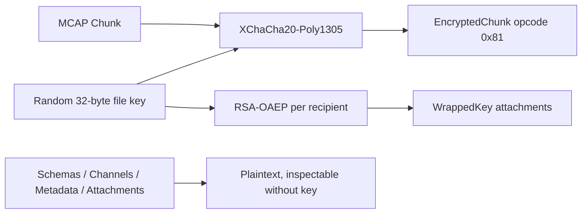

<h1>

mcap-encrypt
</h1>

**Public-key encryption for MCAP robotics logs.**

[](https://github.com/remete618/mcap-encrypt/actions/workflows/ci.yml)
[](https://github.com/remete618/mcap-encrypt/releases/latest)
[](https://www.npmjs.com/package/mcap-encrypt)
[](https://www.npmjs.com/package/mcap-encrypt)
[](https://pkg.go.dev/github.com/remete618/mcap-encrypt)

[](LICENSE)
[](https://scorecard.dev/viewer/?uri=github.com/remete618/mcap-encrypt)
[](https://app.fossa.com/projects/custom%2B62363%2Fgithub.com%2Fremete618%2Fmcap-encrypt?ref=badge_shield&issueType=license)
[](https://renovatebot.com)

Robotics logs contain camera frames, lidar scans, telemetry, and customer-site data. MCAP has great tooling but no native encryption. `mcap-encrypt` protects chunk payloads with XChaCha20-Poly1305 while preserving schemas and channels for inspection and routing. No key required to read file structure.

Encrypting the whole file is easy. Keeping MCAP tooling useful after encryption is the harder part.

📌 *Status:* v0.x · experimental · not externally audited  
✅ *Best for:* MCAP logs at rest, schemas + channels stay readable  
🚫 *Not for:* hiding topic names, timestamps, or attachments

---

## Table of contents

- [What it does](#what-it-does)
- [Alternatives](#alternatives)
- [Security model](#security-model)
- [Quick start](#quick-start)
- [Install](#install)
- [CLI reference](#cli-reference)
- [Go library](#go-library)
- [TypeScript library](#typescript-library)
- [Cross-language compatibility](#cross-language-compatibility)
- [Encrypted file format](#encrypted-file-format)
- [Known limitations](#known-limitations)
- [Contributing](#contributing)
- [License](#license)

---

## What it does

MCAP is the standard container format for robotics sensor data (ROS 2, Foxglove, etc.). Files can contain gigabytes of camera frames, lidar scans, and telemetry. `mcap-encrypt` adds at-rest encryption to those files without changing the outer structure.

<table>
<tr>
<td width="160" nowrap> <strong>1 · Key</strong></td>
<td>A random 32-byte symmetric key is generated per file. A fresh 24-byte nonce is generated per chunk. Nonce reuse is not possible.</td>
</tr>
<tr>
<td width="160" nowrap> <strong>2 · Encrypt</strong></td>
<td>Every chunk is encrypted with <strong>XChaCha20-Poly1305</strong>. The AEAD tag detects any tampering with either the ciphertext or the plaintext metadata.</td>
</tr>
<tr>
<td width="160" nowrap> <strong>3 · Wrap</strong></td>
<td>The file key is <strong>RSA-OAEP-SHA-256</strong> wrapped separately for each recipient and stored as attachments before the first chunk. Any matching private key decrypts.</td>
</tr>
<tr>
<td width="160" nowrap> <strong>4 · Inspect</strong></td>
<td>Schemas and channels stay <strong>plaintext</strong>. Any MCAP tool can read topics, message types, and time ranges without a key.</td>
</tr>
</table>

Decryption is single-pass: all wrapped-key attachments appear before the first encrypted chunk so a decoder can start streaming immediately after finding one that matches.



---

## Alternatives

<table>
<thead>
<tr>
<th align="left">Approach</th>
<th align="center">🔍 MCAP-inspectable<br>after encrypt</th>
<th align="center">⚡ Per-chunk<br>stream</th>
<th align="center">🔑 Public-key<br>recipients</th>
<th align="center">📦 MCAP-<br>native</th>
</tr>
</thead>
<tbody>
<tr>
<td><code>gpg</code> / <code>age</code> (full-file)</td>
<td align="center">❌ no</td>
<td align="center">❌ no</td>
<td align="center">✅ yes <em>(age)</em></td>
<td align="center">❌ no</td>
</tr>
<tr>
<td>Storage-layer <em>(dm-crypt, S3 SSE)</em></td>
<td align="center">✅ yes <em>(mounted)</em></td>
<td align="center">❌ no</td>
<td align="center">❌ no</td>
<td align="center">❌ no</td>
</tr>
<tr>
<td>ROS 1 bag (AES-CBC / GPG)</td>
<td align="center">❌ no</td>
<td align="center">❌ no</td>
<td align="center">❌ no</td>
<td align="center">❌ no</td>
</tr>
<tr>
<td><strong>► mcap-encrypt</strong></td>
<td align="center"><strong>✅ partial</strong><br><small>schemas + channels</small></td>
<td align="center"><strong>✅ yes</strong></td>
<td align="center"><strong>✅ yes</strong></td>
<td align="center"><strong>✅ yes</strong></td>
</tr>
</tbody>
</table>

---

## 🔐 Security model

| Layer | Algorithm | Purpose |
|---|---|---|
| Message encryption | XChaCha20-Poly1305 | Per-chunk authenticated encryption |
| Key wrapping | RSA-2048-OAEP-SHA-256 | Protects the symmetric key at rest |
| Integrity binding | AEAD additional data (AAD) | Binds ciphertext to file identity, chunk position, and plaintext metadata; detects any modification |

**Properties:**

- Each file gets a fresh random 32-byte key and a fresh 24-byte nonce per chunk. Nonce reuse is not possible.
- The AEAD tag (16 bytes, appended to each encrypted chunk) detects any tampering with the ciphertext or the AAD fields.
- The AAD covers: `file_id` (16-byte random file identity), `chunk_index` (zero-based position), `key_id`, `compression`, `uncompressed_size`, `uncompressed_crc`, `message_start_time`, and `message_end_time`. Modifying any of these plaintext fields or the ciphertext fails authentication. Chunk swapping across files is caught by `file_id`; reordering within a file is caught by `chunk_index`.
- The private key is never written to disk by this tool.

**What it does not protect:**

- Attachment content (passes through plaintext, see [Known limitations](#known-limitations)).
- Schema and channel metadata (intentionally plaintext for tool compatibility).
- Against an attacker who has the private key.

**What leaks to anyone who can read the file (no key required):**

| Leaked field | Where |
|---|---|
| Number of topics and their names | Channel records |
| Message schema names and encodings (e.g. `json`, `ros2msg`) | Schema records |
| Number of chunks and the time range of each | EncryptedChunk `message_start_time` / `message_end_time` |
| Approximate per-chunk compressed size | EncryptedChunk record length |
| Compression algorithm per chunk | EncryptedChunk `compression` field |
| Attachment names and media types (non-key attachments) | Attachment records |
| Metadata record keys and values | `Metadata` records |
| Number of recipients and their key fingerprints | WrappedKey Attachment `key_id` field |

If any of the above is sensitive, do not use this tool without additional measures (e.g. strip topic names before encrypting, or use a single-recipient deployment where key fingerprints are not a concern).

---

## Quick start

```bash
# 1. Generate a key pair
mcap-encrypt keygen --out mykey
# Writes mykey.priv.pem (keep secret) and mykey.pub.pem

# 2. Encrypt
mcap-encrypt encrypt --key mykey.pub.pem input.mcap encrypted.mcap

# 3. Decrypt
mcap-encrypt decrypt --key mykey.priv.pem encrypted.mcap output.mcap
```

If the output file already exists, both commands fail with an error. Pass `--force` to overwrite.

---

## Install

### Go CLI

```bash
go install github.com/remete618/mcap-encrypt/cmd/mcap-encrypt@latest
```

Or build from source:

```bash
git clone https://github.com/remete618/mcap-encrypt
cd mcap-encrypt
go build -o mcap-encrypt ./cmd/mcap-encrypt
```

### Go library

```bash
go get github.com/remete618/mcap-encrypt/pkg/mcapencrypt
```

Requires Go 1.26+.

### TypeScript / Node.js

```bash
npm install mcap-encrypt
```

Requires Node.js 18+ (uses the built-in Web Crypto API). Works in modern browsers without polyfills.

---

## CLI reference

```
mcap-encrypt keygen  --out <basename>
mcap-encrypt encrypt --key <pub.pem> [--key <pub2.pem>...] [--force] <input.mcap> <output.mcap>
mcap-encrypt decrypt --key <priv.pem> [--force] <input.mcap> <output.mcap>
```

### keygen

Generates an RSA-2048 key pair.

| Flag | Description |
|---|---|
| `--out <basename>` | Output basename. Writes `<basename>.pub.pem` and `<basename>.priv.pem`. Default: `mcap-key`. |

### encrypt

Encrypts a standard MCAP file. Input must be a chunked MCAP (non-chunked files are rejected with a clear error). Validates magic bytes before starting. Chunks are encrypted in parallel using all available CPU cores.

| Flag | Description |
|---|---|
| `--key <pub.pem>` | Path to RSA public key. Repeatable for multi-recipient. Required. |
| `--force` | Overwrite output file if it exists. |

To encrypt for multiple recipients, repeat `--key`:

```bash
mcap-encrypt encrypt --key alice.pub.pem --key bob.pub.pem input.mcap encrypted.mcap
# Either alice.priv.pem or bob.priv.pem can decrypt the result.
```

### decrypt

Decrypts an encrypted MCAP file. Produces a standard, fully-indexed MCAP readable by any MCAP-compatible tool. The CLI prints a progress spinner and reports throughput on completion.

| Flag | Description |
|---|---|
| `--key <priv.pem>` | Path to RSA private key. Required. |
| `--force` | Overwrite output file if it exists. |

---

## Go library

```go
import "github.com/remete618/mcap-encrypt/pkg/mcapencrypt"

// Generate a key pair, writes <base>.pub.pem and <base>.priv.pem
if err := mcapencrypt.GenerateKeyPair("mykey"); err != nil { ... }

// Encrypt for a single recipient
if err := mcapencrypt.Encrypt("input.mcap", "encrypted.mcap", "mykey.pub.pem"); err != nil { ... }

// Encrypt for multiple recipients; any private key can decrypt
if err := mcapencrypt.EncryptMulti("input.mcap", "encrypted.mcap", []string{
    "alice.pub.pem",
    "bob.pub.pem",
}); err != nil { ... }

// Decrypt: produces a standard indexed MCAP
if err := mcapencrypt.Decrypt("encrypted.mcap", "output.mcap", "mykey.priv.pem"); err != nil { ... }
```

**Notes:**

- `Encrypt` is a convenience wrapper for `EncryptMulti` with a single key.
- `EncryptMulti` wraps the same symmetric key for each public key in the list. The file can be decrypted with any of the corresponding private keys.
- Chunks are encrypted in parallel using `runtime.NumCPU()` goroutines. Output order is deterministic.
- `Decrypt` takes an encrypted MCAP and writes a standard indexed MCAP with zstd-compressed chunks. It tries all wrapped-key attachments and succeeds when one matches.
- If `Encrypt`, `EncryptMulti`, or `Decrypt` fails partway, the output file is automatically removed.

---

## TypeScript library

```typescript
import { generateKeyPair, encryptMcap, decryptMcap, iterateMessages } from "mcap-encrypt";
import { readFileSync, writeFileSync } from "node:fs";

// Generate a key pair (in-memory PEM strings)
const { publicKeyPem, privateKeyPem } = await generateKeyPair();

// Encrypt for a single recipient
const plain = new Uint8Array(readFileSync("input.mcap"));
const encrypted = await encryptMcap(plain, publicKeyPem);
writeFileSync("encrypted.mcap", encrypted);

// Encrypt for multiple recipients; any private key can decrypt
const encrypted2 = await encryptMcap(plain, [alicePubPem, bobPubPem]);

// Decrypt to a fully-indexed MCAP buffer (with ChunkIndex and summary section)
const enc = new Uint8Array(readFileSync("encrypted.mcap"));
const decrypted = await decryptMcap(enc, privateKeyPem);
writeFileSync("output.mcap", decrypted);

// Stream messages directly, no intermediate file
for await (const { schema, channel, message } of iterateMessages(enc, privateKeyPem)) {
  console.log(channel.topic, message.logTime, message.data);
}
```

**API surface:**

| Export | Signature | Description |
|---|---|---|
| `generateKeyPair` | `() => Promise<KeyPair>` | Generates RSA-2048 key pair, returns PEM strings. |
| `encryptMcap` | `(input: Uint8Array, pubKeyPem: string \| string[]) => Promise<Uint8Array>` | Encrypts a chunked MCAP in memory. Pass an array for multi-recipient. |
| `decryptMcap` | `(input: Uint8Array, privKeyPem: string) => Promise<Uint8Array>` | Decrypts to a fully-indexed MCAP buffer with ChunkIndex and summary section. |
| `iterateMessages` | `(input: Uint8Array, privKeyPem: string) => AsyncGenerator<{schema, channel, message}>` | Streams decrypted messages without materializing output. |

**Browser compatibility:** Uses the Web Crypto API and `fzstd` (pure-TypeScript zstd). No WASM, no Node-specific APIs. Works in Chromium 89+, Firefox 90+, Safari 15+.

---

## Cross-language compatibility

Keys and encrypted files produced by the Go CLI are fully compatible with the TypeScript library:

```bash
# Go encrypts, TypeScript decrypts
mcap-encrypt encrypt --key mykey.pub.pem input.mcap enc.mcap
# → decryptMcap(readFileSync("enc.mcap"), privKeyPem) works

# TypeScript encrypts, Go decrypts
# encryptMcap(data, pubKeyPem) → write to ts-enc.mcap
mcap-encrypt decrypt --key mykey.priv.pem ts-enc.mcap output.mcap
```

Both implementations agree on:
- XChaCha20-Poly1305 nonce size (24 bytes), key size (32 bytes)
- AEAD AAD v2 encoding: `file_id` (16 bytes) + `chunk_index` (uint64 LE) + `key_id` + `compression` + `uncompressed_size` (uint64 LE) + `uncompressed_crc` (uint32 LE) + `message_start_time` (uint64 LE) + `message_end_time` (uint64 LE)
- RSA-OAEP-SHA-256 key wrapping
- `EncryptedChunk` wire format (opcode `0x81`)
- Wrapped key attachment format (version `0x02`, 16-byte `file_id`, length-prefixed fields)
- PKCS#8 private key format (PEM label `PRIVATE KEY`)

Cross-language compatibility is verified by automated interop tests in CI.

**Compression note:** The Go library automatically re-compresses LZ4 chunks to zstd during encryption, so any source MCAP is safe to pass to `mcap-encrypt encrypt`. The TypeScript library does **not** support LZ4 input; `encryptMcap()` throws a clear error if the source contains LZ4 chunks. Use the Go CLI to normalize those files first.

---

## Encrypted file format

The outer file is a valid MCAP. Standard MCAP readers can open it and inspect schemas and channels. They will not find any messages because the `EncryptedChunk` opcode (`0x81`) is not a standard MCAP record type.

```
[magic] [Header] [Schema]* [Channel]* [WrappedKeyAttachment]+ [EncryptedChunk]* [DataEnd] [Footer] [magic]
```

There is one `WrappedKeyAttachment` per recipient. All wrapped copies encode the same symmetric key, wrapped separately for each public key.

### WrappedKeyAttachment

A standard MCAP Attachment record (opcode `0x09`) with:

| Field | Value |
|---|---|
| `name` | `mcap_encryption_key` |
| `media_type` | `application/x-mcap-wrapped-key` |
| `data` | Binary payload described below |

The `data` payload (all strings and byte fields use 4-byte LE length prefixes):

| Field | Description |
|---|---|
| version | `0x02` (uint8) |
| file_id | 16 random bytes; same across all recipients of the same file |
| key_id | Hex-encoded SHA-256 of the recipient's SPKI public key DER encoding |
| algorithm | `xchacha20poly1305` |
| kek_algorithm | `rsa-oaep-sha256` |
| wrapped_key | RSA-OAEP-SHA-256 ciphertext of the 32-byte symmetric key (256 bytes for RSA-2048) |

### EncryptedChunk (opcode `0x81`)

| Field | Type | Description |
|---|---|---|
| `message_start_time` | `uint64 LE` | Plaintext; earliest log time in this chunk |
| `message_end_time` | `uint64 LE` | Plaintext; latest log time in this chunk |
| `uncompressed_size` | `uint64 LE` | Byte length of the records after decompression |
| `uncompressed_crc` | `uint32 LE` | CRC32-IEEE of the decompressed records (0 = not checked) |
| `compression` | `string` | Compression applied before encryption: `"zstd"` or `""` |
| `key_id` | `string` | Content-key slot identifier included in AAD. Currently always `"key-1"`; not the recipient fingerprint. |
| `nonce` | `bytes` | 24-byte XChaCha20 nonce (4-byte LE length prefix + 24 bytes) |
| `encrypted_data` | `bytes` | Ciphertext including the 16-byte Poly1305 tag (4-byte LE length prefix + N bytes) |

All `WrappedKeyAttachment` records appear before the first `EncryptedChunk`. Decoders can begin streaming decryption in a single pass without buffering chunks.

See [FORMAT.md](FORMAT.md) for the complete binary specification including AAD serialization and version history.

---

## Known limitations

The following are current constraints, not bugs. The cryptographic core uses standard AEAD primitives (XChaCha20-Poly1305) and is covered by adversarial and fuzz tests. It has not been externally audited.

### Functional limitations

| Limitation | Impact | Workaround |
|---|---|---|
| **No key rotation** | To change the key, you must re-encrypt the entire file. | Re-run `encrypt` with the new public key after decrypting with the old one. |
| **Attachments are not encrypted** | Attachment content passes through in plaintext. | Encrypt sensitive attachments before writing to the MCAP. |
| **Metadata records are not encrypted** | Arbitrary key-value metadata passes through in plaintext. | Strip or sanitize Metadata records before encrypting if they contain sensitive values. |
| **Input must be chunked** | Non-chunked MCAP files are rejected. | Re-encode with chunking enabled (the Foxglove CLI and most MCAP writers produce chunked output by default). |

### TypeScript-specific limitations

| Limitation | Impact | Notes |
|---|---|---|
| **In-memory only** | The TypeScript API holds the entire file in a `Uint8Array`. | Use the Go CLI for files larger than available RAM. |
| **No LZ4 support** | `encryptMcap()` throws if any source chunk uses LZ4 compression. Cannot decompress LZ4-encrypted chunks. | Use the Go CLI to encrypt LZ4 source files; it normalizes to zstd automatically. |

### Not yet implemented

- Python library.

---

## Contributing

Issues and PRs welcome at [github.com/remete618/mcap-encrypt](https://github.com/remete618/mcap-encrypt).

**Best tasks to pick up:**

| # | Task | Difficulty | Issue |
|---|---|---|---|
| 1 | LZ4 rejection test + multi-chunk regression test (TypeScript) | small | [#9](https://github.com/remete618/mcap-encrypt/issues/9) |
| 2 | `mcap-encrypt inspect` command | medium | [#14](https://github.com/remete618/mcap-encrypt/issues/14) |
| 3 | Browser smoke test (Vitest browser mode) | medium | [#17](https://github.com/remete618/mcap-encrypt/issues/17) |
| 4 | Go benchmark script + README throughput table | medium | [#16](https://github.com/remete618/mcap-encrypt/issues/16) |
| 5 | CONTRIBUTING.md + GitHub issue templates | small | [#19](https://github.com/remete618/mcap-encrypt/issues/19) |
| 6 | Bound in-memory chunk buffering for large files (Go) | large | [#15](https://github.com/remete618/mcap-encrypt/issues/15) |

Run tests locally before opening a PR:

```bash
# Go
go test ./...

# TypeScript
cd ts && npm test

# Interop (requires Go installed)
cd ts && npm run test:interop
```

---

## License

MIT License. Copyright (c) 2026 Radu Cioplea. See [LICENSE](LICENSE) for the full text.

Contact: radu@cioplea.com · [github.com/remete618](https://github.com/remete618) · [www.eyepaq.com](https://www.eyepaq.com)
